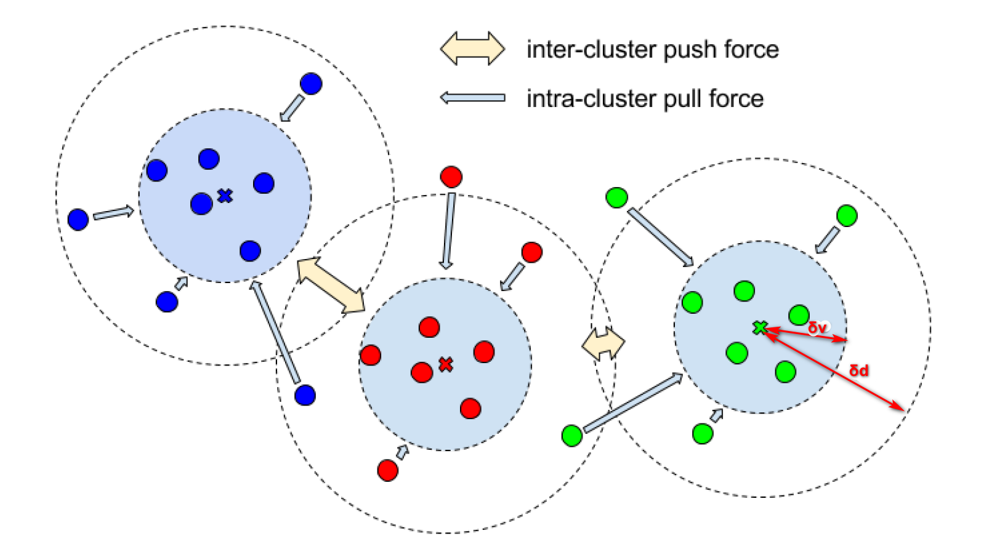

[带有歧视的损失函数的语义实体分割（Semantic Instance Segmentation with a Discriminative Loss Function）](论文地址)

论文提出一种将特征空间的点分簇的损失函数，损失函数主要分为三项构成，分别为方差项（variance term），距离项（distance term），正则项（regulariztion trem），其中方差项计算的是簇内的距离，距离项计算的是簇与簇的距离，分别控制同簇点与簇中心之间的距离在`δv`之内，不同簇与簇的中心距离大于`δd`，[论文下载地址](https://arxiv.org/pdf/1703.10277.pdf)

<!--more-->

论文主要关注于损失函数，主要关注于训练出好的特征空间（如`Embedding Space`）。

## 带有歧视的损失函数 ##

### 定义 ###

$C$是真实值中的簇的总数，$N_c$簇$c$中的元素数量，$x_i$是一个元素对应的嵌入向量，$\mu_c$是&c&簇中嵌入向量的平均值（簇的中心），$\vert\vert\cdot\vert\vert$是L1距离或者L2距离，$[x]_+$是max(0,x)定义的铰链函数，$\delta_v$和$\delta_d$代表方差和距离损失的间隙。

在实验时，作者设置$\alpha=\beta=1$，$\gamma=0.001$。

### 方差项 ###

$$L_{var} = \frac{1}{C}\sum_{c=1}^C\frac{1}{N_c}\sum_{i=1}^{N_c}[||{\mu_i-x_i}||-\delta_v]_+^2$$

### 距离项 ###

$$L_{dist}=\frac{1}{C(C-1)}{\sum_{c_A=1}^{C}\sum_{c_B=1}^{C}}_{c_A \neq c_B}[2\delta_d-||{\mu_{c_A}-\mu_{c_B}}||]_+^2$$

### 正则项 ###

$$L_{reg}=\frac{1}{C}\sum_{c=1}^{C}||\mu_c||$$

### 完整损失函数 ###
$$L=\alpha\cdot{L_{var}}+\beta\cdot{L_{dist}}+\gamma\cdot{L_{reg}}$$

## 其他内容 ##

论文还说到了后处理（post-processing），包括增强鲁棒性（increasing robustness）等等， 还有其他实验的设置和数据集，还有优缺点等等，这里最后说一下这个方法的优缺点（pros and cons）。

### 优缺点 ###
论文中方法，在有重叠部分的情况下依然有好的效果，比如在合成的零散的线条中，在数据集图片中有比较相似的实例时，效果也比较好，但是，在随机多种多样的数据集中，效果不太好，在只有一个的实例对象的图片中训练效果不是太好。

### MathJax数学公式 ###
[MathJax语法](https://www.cnblogs.com/Bone-ACE/p/4558870.html)
[在线MathJax公式书写](http://cxcgzx.cn:88/test/mathtest.php)

