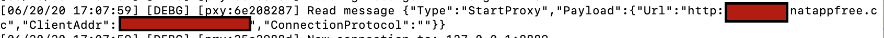

之前本来没想弄这个[natapp](https://natapp.cn)的，奈何天意需要弄一下，学校服务器在昨晚11左右不知道是重启了一下，还是怎么了，然后客服端离线了，连不上，然后同学在使用的时候来不上，找到了我，然后我又了解了一下`natapp`，然后还开了一个免费的通道给`jupyter notebook`。

<!--more-->

## 故事的开始

服务器不知道是咋滴啦，frp客户端掉了，natapp客户端也掉了。


开启了了解这个natapp之路。

## 配置natapp SSH通道

以创建免费的SSH通道为例。

### 1、创建SSH隧道

登录到natapp网页，在【我的隧道】中，点击【购买隧道】，就可以看到一个【免费隧道】，点击它，选择隧道协议，【TCP】（这里有三种，TCP、UDP、WEB），然后设置【本地端口】（设置默认的SSH端口22吧），点击【免费购买】，创建隧道成功。

### 2、下载natapp

[下载natapp地址](https://natapp.cn/#download)

下载对应的系统的版本的natapp。

### 3、配置config.ini文件

创建一个`config.ini`文件，将下面的内容复制进去，再将authtoken复制进去，然后配置一下log，也可以不配置，在启动客户端的时候加入命令参数。如`$ ./natapp -log=stdout -loglevel=ERROR`

```ini
#将本文件放置于natapp同级目录 程序将读取 [default] 段
#在命令行参数模式如 natapp -authtoken=xxx 等相同参数将会覆盖掉此配置
#命令行参数 -config= 可以指定任意config.ini文件
[default]
authtoken=                      #对应一条隧道的authtoken
clienttoken=                    #对应客户端的clienttoken,将会忽略authtoken,若无请留空,
log=none                        #log 日志文件,可指定本地文件, none=不做记录,stdout=直接屏幕输出 ,默认为none
loglevel=ERROR                  #日志等级 DEBUG, INFO, WARNING, ERROR 默认为 DEBUG
http_proxy=                     #代理设置 如 http://10.123.10.10:3128 非代理上网用户请务必留空
```

### 4、启动natapp

执行如下命令，也可以参考[natapp给出的教程](https://natapp.cn/article/nohup)

```shell
nohup ./natapp -config=config.ini -log=stdout  >>log.out 2>&1  &
```

这里指定了配置文件，是因为我后续还增加了一个免费的web通道。

### 5、测试SSH连接

由于免费的没有固定的域名和端口，它会在启动的时候给定，我们可以在log.out中找到对于的url，这里的图，我是用的web隧道的，因为我们使用了付费的SSH通道，又固定的域名与端口。


使用对应的的域名与端口，执行ssh命令，测试是否可以连接。

## 新增免费的隧道

对于每个一个注册用户，natapp提供两个免费的不同协议的隧道，下面创建免费的web通道。


### 1、创建Web隧道

与[创建SSH隧道](#1创建ssh隧道)类似，将【隧道协议】改成【web】,其他步骤一致。

### 2、配置隧道

之前已经下载了natapp，这里只需要创建一个新的配置文件，例如`webconfig.ini`（这可以直接复制成一个新的文件`cp config.ini webconfig.ini`），再进行之前与SSH通道类似的的[配置config.ini文件](#3配置configini文件)就行，将对应的authtoken换上去。


### 3、启动并测试

- 与之前SSH[启动natapp](#4启动natapp)类似，指定一下配置文件就好了，如下，

    ```shell
    nohup ./natapp -config=webconfig.ini -log=stdout  >>weblog.out 2>&1  &
    ```

- 启动一个web服务，比如jupyter notebook，指定端口为之前创建隧道时设置的端口，命令如下。

    ```shell
    nohup jupyter notebook --port 8888 >>jupyter.out 2>&1  &
    ```

    需要注意的是，一定要指定端口为之前创建隧道时设置的端口，`jupyter notebook`远程设置可以参考我上一篇博客。

- 在log文件中找到链接，看链接是否可以正常访问。

## 总结

总结一下，这个natapp配置起来，其实也和frp配置起来差不多，没有多复杂，natapp基于ngrok还是做了一些简化吧，不错，收费也不高，怎么说呢，说不高也不高，其实说高也高，它按单个隧道来付费。有好的带宽的外网服务器的话，我还是比较推荐开源的frp吧，没有必要花额外的钱了。
