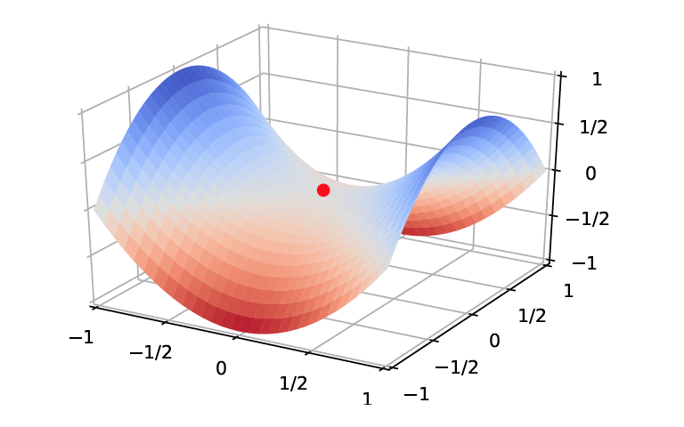
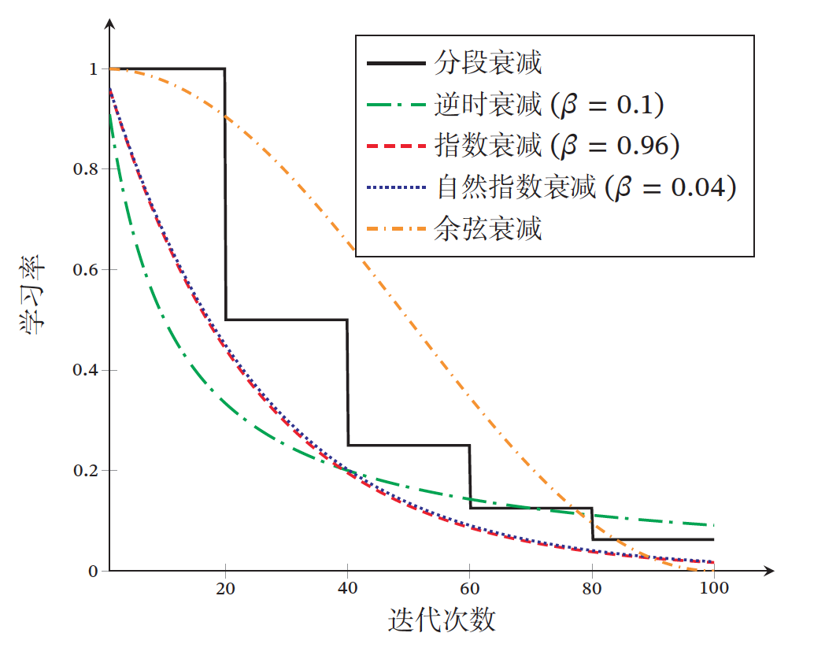
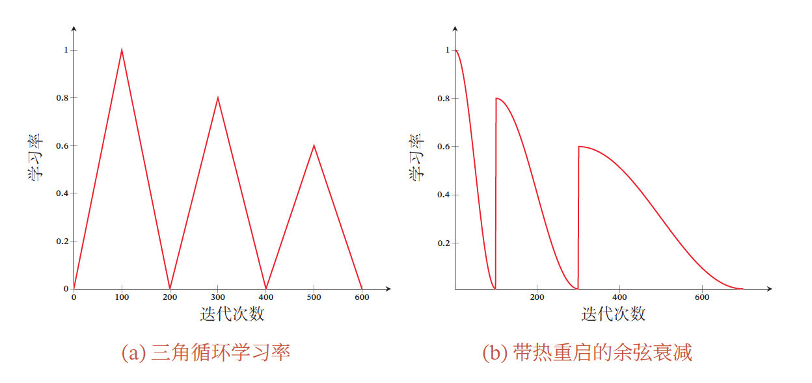
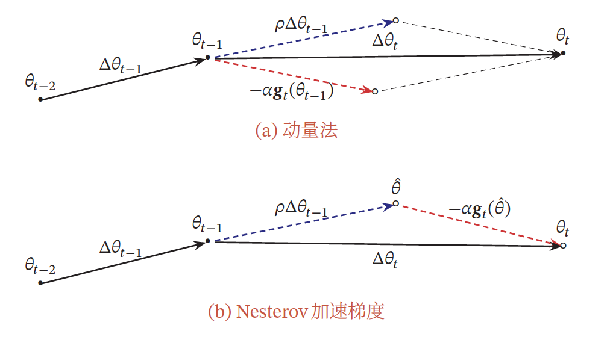
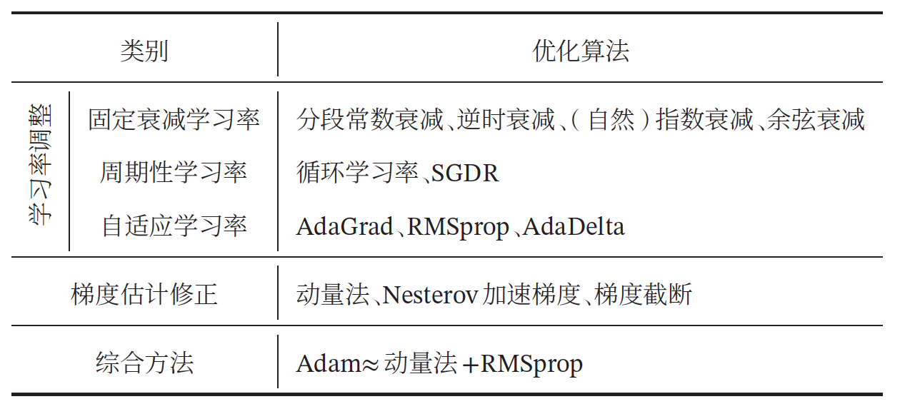
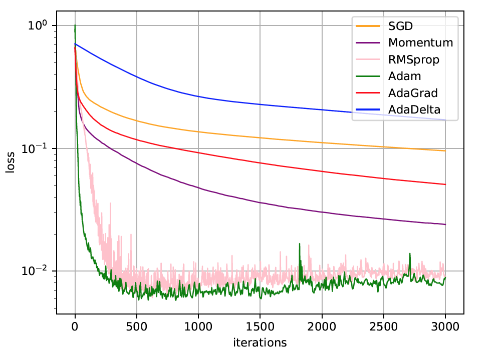
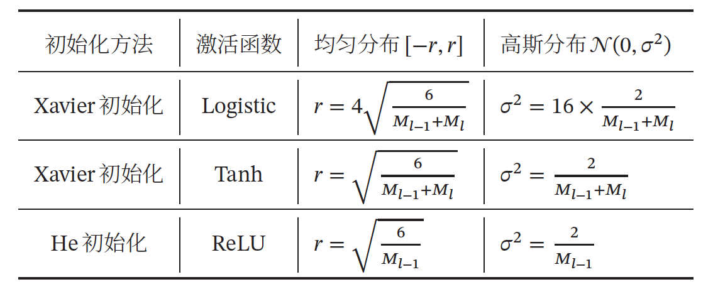
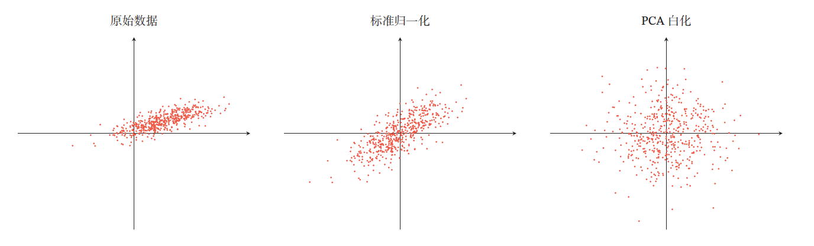
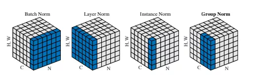

[神经网络与深度学习](https://nndl.github.io)，第七章-网络优化与正则化，笔记。

网络优化主要介绍一些常用的优化算法、参数初始化方法、数据预处理方法、逐层归一化方法和超参数优化方法。

网络正则化主要介绍一些提高泛化能力的方法，包括$l_1$和$l_2$正则化、权重衰减、提前停止、丢弃法、数据增强和标签平滑。

<!--more-->

## 网络优化

*网络优化*

网络优化是指寻找一个神经网络模型来使得经验（或结构）风险（损失）最小化的过程，包括模型选择以及参数学习等。深度神经网络是一个高度非线性的模型，它的损失函数是一个非凸函数，因此最小化损失是一个非凸优化问题．

*鞍点（Saddle Point）与局部最小值（Local Minima）*

在高维空间中，非凸优化的难点并不在于如何逃离局部最优点，而是如何逃离鞍点（鞍点示意图如下），鞍点的梯度是0，但是在一些维度上是最高点，在另一些维度上是最低点。相比鞍点，局部最小值要求在每一维度上都是最低点。

*局部最小解的等价性*

在非常大的神经网络中，大部分的局部最小解是等价的，它们在测试集上性能都比较相似。**在训练神经网络时，我们通常没有必要找全局最小值，这反而可能导致过拟合。**

*神经网络优化的改善方法*

目前比较有效的经验性改善方法通常分为以下几个方面：

1. **使用更有效的优化算法**来提高梯度下降优化方法的效率和稳定性，比如动态学习率调整、梯度估计修正等。
2. **使用更好的参数初始化方法、数据预处理方法**，来提高优化效率．
3. **修改网络结构来得到更好的优化地形（Optimization Landscape，好的优化地形即比较平滑的损失函数的曲面形状）**，比如使用ReLU 激活函数、残差连接、逐层归一化等。
4. **使用更好的超参数优化方法**。

### 优化算法 - 梯度下降

目前，深度神经网络的参数学习主要是通过**梯度下降法**来寻找一组可以最小化结构风险的参数。在具体实现中，梯度下降法可以分为：

1. **批量梯度下降**（Batch Gradient Descent，在更新参数时，使用*所有的样本*来进行更新。）
2. **随机梯度下降**（Stochastic Gradient 是在更新参数时都使用*一个样本*来进行更新。）
3. **小批量梯度下降**（Mini-batch Gradient Descent，是在更新参数时都使用*一部分样本*来进行更新。）

*梯度下降公式*

令$f(x;\theta)$表示一个深度神经网络，$\theta$为网络参数，在使用小批量梯度下降进行优化时，每次选取$K$个训练样本$S_t={(x(k), y(k))}^K_{k=1}$。第$t$次迭代（Iteration）时损失函数关于参数$\theta$的偏导数为
$$
G_t(\theta) = \frac{1}{K} \sum_{(x,y) \in S_t}\frac{\partial L(y, f(x;\theta))}{\partial \theta}
$$
其中$L(\cdot)$为可微分的损失函数，$K$为批量大小（Batch Size）。

第$t$次更新的梯度${\rm g_t}$定义为
$$
{\rm g}_t \triangleq G_t(\theta_{t-1})
$$

更新参数，$\alpha(\alpha > 0)$为学习率。
$$
\theta_t \leftarrow \theta_{t-1}- \alpha {\rm g}_t
$$
每次迭代时参数更新的差值$\Delta \theta_t$定义为
$$
\Delta \theta_t \triangleq \theta_t-\theta_{t-1}
$$

$\Delta \theta_t$和梯度${\rm g_t}$并不需要完全一致（有时候会实际情况对梯度${\rm g_t}$进行调整）。$\Delta \theta_t$为每次迭代时参数的实际更新方向，即
$\theta_t = \theta_{t-1} + \Delta \theta_t$。在标准的小批量梯度下降中，$\Delta \theta_t = - \alpha {\rm g}_t$。

从上面公式可以看出，影响梯度下降法的主要因素有：

1. 批量大小$K$
2. 学习率$\alpha$
3. 梯度估计

#### *批量大小$K$*选择

一般而言，批量大小不影响随机梯度的期望，但是会影响随机梯度的方差。批量大小越大，随机梯度的方差越小，引入的噪声也越小，训练也越稳定，因此可以设置较大的学习率；而批量大小较小时，需要设置较小的学习率，否则模型会不收敛。学习率通常要随着批量大小的增大而相应地增大。（可以使用线性缩放规则（Linear Scaling Rule），当批量大小增加$m$倍时，学习率也增加$m$倍。）**根据GPU资源来设置批量$K$**。

#### 学习率$\alpha$调整

在梯度下降法中，学习率$\alpha$的取值非常关键，如果过大就不会收敛，如果过小则收敛速度太慢。

常用的学习率调整方法包括学习率衰减、学习率预热、周期性学习率调整以及一些自适应调整学习率的方法。

- 学习率衰减
  常见的衰减方法有以下几种：
  1. 分段常数衰减（Piecewise Constant Decay），也称为阶梯衰减（Step Decay）
  2. 逆时衰减（Inverse Time Decay）
  3. 指数衰减（Exponential Decay）
  4. 自然指数衰减（Natural Exponential Decay）
  5. 余弦衰减（Cosine Decay）

- 学习率预热
    在小批量梯度下降法中，当批量大小的设置比较大时，通常需要比较大的学习率．但在刚开始训练时，由于参数是随机初始化的，梯度往往也比较大，再加上比较大的初始学习率，会使得训练不稳定。为了提高训练稳定性，我们可以在最初几轮迭代时，采用比较小的学习率，等梯度下降到一定程度后再恢复到初始的学习率，这种方法称为学习率预热（Learning Rate Warmup）。

    常用的学习率预热方法是逐渐预热（Gradual Warmup），设定预热的迭代次数（作为分母，当前迭代次数作为分子），逐渐让学习率接近初始学习率，直到等于初始学习率。

- 周期性学习率调整
 
    两种常用的周期性调整学习率的方法：

    *循环学习率*，学习率在一个区间内周期性地增大和缩小。

    *带热重启的随机梯度下降*，学习率每间隔一定周期后重新初始化为某个预先设定值，然后逐渐衰减．每次重启后模型参数不是从头开始优化，而是从重启前的参数基础上继续优化。

- AdaGrad 算法
  
  AdaGrad 算法（Adaptive Gradient Algorithm）是借鉴
  $L_2$正则化的思想，每次迭代时自适应地调整每个参数的学习率。每次迭代时，先计算每个参数梯度平方的累计值，将这个累计值开根作为分母，初始学习作为分子，从而实现学习率随着迭代次数的增加逐渐缩小。

  在AdaGrad 算法中，如果某个参数的偏导数累积比较大，其学习率相对较小；相反，如果其偏导数累积较小，其学习率相对较大．但整体是随着迭代次数的增加，学习率逐渐缩小。
  
  AdaGrad 算法的缺点是在经过一定次数的迭代依然没有找到最优点时，由于这时的学习率已经非常小，很难再继续找到最优点。

- RMSprop 算法
  
  RMSProp 算法和AdaGrad 算法的区别在于梯度平方的累计值的计算由加上了指数衰减，前面的梯度对当前的梯度影响逐渐变小，将其加起来来确定当前参数学习率。在迭代过程中，每个参数的学习率并不是呈衰减趋势，既可以变小也可以变大，这样可以在有些情况下避免AdaGrad算法中学习率不断单调下降以至于过早衰减的缺点。

- AdaDelta 算法
  也是AdaGrad 算法的一个改进。使用RMSprop 算法同样的方式来调整学习率。此外，AdaDelta 算法将RMSprop 算法中的初始学习率$\alpha$改为动态计算的$\sqrt{\Delta X_{t-1}^2}$在一定程度上平抑了学习率的波动。

#### 梯度估计修正

- 动量法
  
  动量（Momentum）是模拟物理中的概念。一个物体的动量指的是该物体在它运动方向上保持运动的趋势，是该物体的质量和速度的乘积．动量法（Momentum Method）是用之前积累动量来替代真正的梯度．每次迭代的梯度可以看作加速度。

  每个参数的实际更新差值取决于最近一段时间内梯度的加权平均值，当某个参数在最近一段时间内的梯度方向不一致时，其真实的参数更新幅度变小；相反，当在最近一段时间内的梯度方向都一致时，其真实的参数更新幅度变大，起到加速作用．一般而言，在迭代初期，梯度方向都比较一致，动量法会起到加速作用，可以更快地到达最优点．在迭代后期，梯度方向会不一致，在收敛值附近振荡，动量法会起到减速作用，增加稳定性。

  类似于RMSprop 算法，前面的梯度对当前的梯度影响逐渐变小，并将其加起来作为更新参数的梯度，而且参数更新对前一次迭代的参数有一个惯性（相当于初速度），而梯度相当于加速度。

- Nesterov 加速梯度

  Nesterov 加速梯度（Nesterov Accelerated Gradient，NAG）是一种对动量法的改进，也称为Nesterov 动量法（Nesterov Momentum）。

  Nesterov 加速梯度与动量法 思想是类似的，但是认为使用前一次迭代参数的梯度作为加速度是不太合理的，应该使用动量（惯性）移动到了的地方的加速度（偏导）来计算下一次迭代的参数（速度）。

- Adam 算法和Nadam 算法

  Adam算法（Adaptive Moment Estimation Algorithm）可以看作动量法和RMSprop 算法的结合。不但使用动量作为参数更新方向，而且可以自适应调整学习率。

  而Nadam 算法是Nesterov 加速梯度与RMSprop 算法的结合。

- 梯度截断

  为了避免梯度突然增大使得参数远离最优点，当梯度的模大于一定阈值时，就对梯度进行截断，称为梯度截断（Gradient Clipping）。

  梯度截断是一种比较简单的启发式方法，把梯度的模限定在一个区间，当梯度的模小于或大于这个区间时就进行截断．一般截断的方式有以下几种：

      *按值截断* ，给定一个区间$[a, b]$，如果一个参数的梯度小于$a$时，就将其设为$a$；如果大于$b$时，就将其设为$b$.
      
      *按模截断* ，给定的截断阈值$b$，当梯度的模小于等于$b$时，不改变梯度，当梯度的模大于$b$时，梯度等于$b$除以梯度的模再乘以梯度（将梯度的模缩放到$b$以内）。

  在训练循环神经网络时，按模截断是避免梯度爆炸问题的有效方法。

#### 神经网络常用优化方法的汇总

不同优化方法的比较

### 参数初始化

当使用梯度下降法来进行优化网络参数时，参数初始值的选取十分关键，关系到网络的优化效率和泛化能力。参数初始化的方式通常有以下三种：

1. 预训练初始化：使用一个已经在大规模数据上训练过的模型提供参数初始值。
2. 随机初始化
3. 固定值初始化：：对于一些特殊的参数，我们可以根据经验用一个特殊的固定值来进行初始化。

预训练初始化通常具有更好的收敛性和泛化性，但是灵活性不够，不能在目标任务上任意地调整网络结构，所以有时还是只能使用随机初始化方法来初始化参数。

#### 三类常用的随机初始化方法

基于固定方差的参数初始化、基于方差缩放的参数初始化和正交初始化方法。

*基于固定方差的参数初始化*

随机初始化方法是从一个固定均值（通常为0）和方差$\sigma^2$的分布中采样来生成参数的初始值。基于固定方差的参数初始化方法主要有以下两种：

高斯分布初始化：使用一个高斯分布$N(0, \ \sigma^2)$对每个参数进行随机初始化。

均匀分布初始化：在一个给定的区间$[r, -r]$内采用均匀分布来初始化参数。

*基于方差缩放的参数初始化*

初始化一个深度网络时，为了缓解梯度消失或爆炸问题，我们尽可能保持每个神经元的输入和输出的方差一致，**根据神经元的连接数量来自适应地调整初始化分布的方差**，这类方法称为方差缩放（Variance Scaling）。

Xavier 初始化和He 初始化的具体设置情况，$M_{l-1}$和$M_l$分别为输入输出的神经元个数。

*正交初始化*

将权重矩阵初始化为正交矩阵的方法称为正交初始化（Orthogonal Initialization），正交初始化的具体实现过程可以分为两步：

1. 用均值为0、方差为1 的高斯分布初始化一个矩阵。
2. 将这个矩阵用奇异值分解得到两个正交矩阵，并使用其中之一作为权重矩阵。

### 数据预处理

如果一个机器学习算法在缩放全部或部分特征后不影响它的学习和预测，我们就称该算法具有尺度不变性（Scale Invariance）。尺度就是取值范围。

#### 归一化（Normalization）

归一化（Normalization）方法泛指把数据特征转换为相同尺度的方法，比如

1. 最小最大值归一化（Min-Max Normalization）把数据特征映射到[0, 1] 或[−1, 1] 区间内。

2. 标准化（Standardization）也叫Z 值归一化（Z-Score Normalization）把数据特征映射为服从均值为0、方差为1的标准正态分布。

#### 白化（Whitening）

白化（Whitening）是一种重要的预处理方法，用来降低输入数据特征之间的冗余性．输入数据经过白化处理后，特征之间相关性较低，并且所有特征具有相同的方差．白化的一个主要实现方式是使用**主成分分析（Principal Component Analysis，PCA）**方法去除掉各个成分之间的相关性。

标准归一化和PCA 白化的比较

### 逐层归一化

逐层归一化（Layer-wise Normalization）是对神经网络中隐藏层的输入进行归一化，从而使得网络更容易训练。

逐层归一化可以有效提高训练效率的原因：

1. 更好的尺度不变性，把每个神经层的输入分布都归一化为标准正态分布，可以使得每个神经层对其输入具有更好的**尺度不变性**。不论低层的参数如何变化，高层的输入保持相对稳定。另外，尺度不变性可以使得我们更加高效地进行参数初始化以及超参数的选择。
2. 更平滑的优化地形，逐层归一化一方面可以使得大部分神经层的输入处于不饱和区域，从而让梯度变大，避免梯度消失问题；另一方面还可以使得神经网络的优化地形（Optimization Landscape）更加平滑，以及使梯度变得更加稳定，从而允许我们使用更大的学习率，并提高收敛速度。

比较常用的逐层归一化方法：批量归一化、层归一化、权重归
一化和局部响应归一化。

#### 批量归一化（Batch Normalization）

对输出的张量（N, C, H, W），基于N x H x W个数值求均值和方差进行归一化。

#### 层归一化（Layer Normalization）

对输出的张量（N, C, H, W），基于C x H x W个数值求均值和方差进行归一化。

#### 实例归一化（Instance Normalization）

对输出的张量（N, C, H, W），基于H x W个数值求均值和方差进行归一化。

#### 分组归一化（Group Normalization）

对输出的张量（N, C, H, W），基于G x H x W个数值求均值和方差进行归一化。

G是分组数，需要满足C可以整除G。

[参考博客：An Overview of Normalization Methods in Deep Learning](https://mlexplained.com/2018/11/30/an-overview-of-normalization-methods-in-deep-learning/)

#### 权重归一化（Weight Normalization）

对权重或者说参数进行归一化。

#### 局部响应归一化（Local Response Normalization，LRN）

局部响应归一化和层归一化都是对同层的神经元进行归一化．不同的是，**局部响应归一化应用在激活函数之后**，只是对邻近的神经元进行局部归一化，并且不减去均值。邻近的神经元指对应同样位置的邻近特征映射。

局部响应归一化和生物神经元中的**侧抑制（lateral inhibition）现象**比较类似，即活跃神经元对相邻神经元具有抑制作用。当使用ReLU 作为激活函数时，神经元的活性值是没有限制的，局部响应归一化可以起到平衡和约束作用。如果一个神经元的活性值非常大，那么和它邻近的神经元就近似地归一化为0，从而起到抑制作用，增强模型的泛化能力。**最大汇聚**也具有侧抑制作用．但最大汇聚是对同一个特征映射中的邻近位置中的神经元进行抑制，而局部响应归一化是对同一个位置的邻近特征映射中的神经元进行抑制．

### 超参数优化（Hyperparameter Optimization）

常见的超参数有以下三类：

1. 网络结构，包括神经元之间的连接关系、层数、每层的神经元数量、激活函数的类型等。
2. 优化参数，包括优化方法、学习率、小批量的样本数量等。
3. 正则化系数。

超参数优化主要存在两方面的困难：

1. 超参数优化是一个组合优化问题，无法像一般参数那样通过梯度下降方法来优化，也没有一种通用有效的优化方法；
2. 评估一组超参数配置（Configuration）的时间代价非常高，从而导致一些优化方法（比如演化算法（Evolution Algorithm））在超参数优化中难以应用。

对于超参数的配置，比较简单的方法有网格搜索、随机搜索、贝叶斯优化、动态资源分配和神经架构搜索。（都是搜索超参数的值的策略）

#### 网格搜索（Grid Search）

网格搜索是一种通过尝试所有超参数的组合来寻址合适一组超参数配置的方法。假设有K个超参数，第K个超参数有可能合适的值$m_k$个。那么总共的配置组合数量为$m_1 *  m_2 * \cdot x * m_K$，每次尝试一组，最后选择最好的训练结果下对应的超参数值。

#### 随机搜索（Random Search）

采用网格搜索会在不重要的超参数上进行不必要的尝试。一种在实践中比较有效的改进方法是对超参数进行随机组合，然后选取一个性能最好的配置，这就是随机搜索（Random Search）。

#### 贝叶斯优化（Bayesian optimization）

贝叶斯优化（Bayesian optimization）是一种自适应的超参数优化方法。根据当前已经试验的超参数组合，来预测下一个可能带来最大收益的组合。

#### 动态资源分配

在超参数优化中，每组超参数配置的评估代价比较高。如果我们可以在较早的阶段就估计出一组配置的效果会比较差，那么我们就可以中止这组配置的评估，将更多的资源留给其他配置。（相当于做一个提前停止（Early-Stopping））。

这个问题可以归结为多臂赌博机问题的一个泛化问题：最优臂问题（Best-Arm Problem），即在给定有限的机会次数下，如何玩这些赌博机并找到收益最大的臂。和多臂赌博机问题类似，最优臂问题也是在利用和探索之间找到最佳的平衡。

有一种策略是逐次减半（Successive Halving），我们可以通过$T=  \lceil log_2(N) - 1 \rceil$轮逐次减半的方法来选取最优的配置，每次都选取一半最优资源，并固定住。

#### 神经架构搜索

神经架构搜索，通过神经网络来自动实现网络架构的设计。利用元学习的思想，神经架构搜索利用一个控制器来生成另一个子网络的架构描述。控制器可以由一个循环神经网络来实现。控制器的训练可以通过强化学习来完成，其奖励信号为生成的子网络在开发集上的准确率。（用神经网络来自动实现网络架构）

## 网络正则化

正则化（Regularization）是一类通过限制模型复杂度，从而避免过拟合，提高泛化能力的方法。

在传统的机器学习中，提高泛化能力的方法主要是限制模型复杂度，比如采用$l1$和$l2$正则化等方式。而在训练深度神经网络时，特别是在过度参数化（Over-Parameterization）时，$l1$和$l2$正则化的效果往往不如浅层机器学习模型中显著。过度参数化是指模型参数的数量远远大于训练数据的数量。因此训练深度学习模型时，往往还会使用其他的正则化方法，比如数据增强、提前停止、丢弃法、集成法等。

### $l1$和$l2$正则化

$l1$和$l2$正则化是机器学习中最常用的正则化方法，通过约束参数的$l1$和$l2$范数来减小模型在训练数据集上的过拟合现象。

同时加$l1$和$l2$正则化，称为弹性网络正则化（Elastic Net Regularization

### 权重衰减

权重衰减（Weight Decay），在每次参数更新时，引入一个衰减系数
$$
\theta_t \leftarrow (1 - \beta)\theta_{t-1} - \alpha {\rm g}_t
$$

其中${\rm g}_t$为第$t$步更新时的梯度，$\alpha$为学习率，$\beta$为权重衰减系数，一般取值比较小，比如0.0005。

### 提前停止

提前停止（Early Stop），使用梯度下降法进行优化时，我们可以使用一个和训练集独立的样本集合，称为验证集（Validation Set），并用验证集上的错误来代替期望错误。当验证集上的错误率不再下降，就停止迭代。

### 丢弃法

当训练一个深度神经网络时， 我们可以随机丢弃一部分神经元（同时丢弃其对应的连接边）来避免过拟合，这种方法称为丢弃法（Dropout Method）

丢弃法一般是针对神经元进行随机丢弃，但是也可以扩展到对神经元之间的连接进行随机丢弃，或每一层进行随机丢弃。

在循环神经网络上的应用丢弃法，有两种方法：

1. 对非时间维度的连接（即非循环连接）进行随机丢失。
2. 对参数矩阵的每个元素进行随机丢弃，并在所有时刻都使用相同的丢弃掩码（丢弃掩码定义如下）。

掩蔽函数$mask(\cdot)$，
$$
mask(\cdot) =
\begin{cases}
m \odot x & 当训练阶段时 \\
p x & 当测试阶段时
\end{cases}
$$

$m \in \{0, 1\}^D$是丢弃掩码（Dropout Mask）,$p$为保留的概率。

### 数据增强

深度神经网络一般都需要大量的训练数据才能获得比较理想的效果．在数据量有限的情况下，可以通过数据增强（Data Augmentation）来增加数据量，提高模型鲁棒性，避免过拟合。

增强的方法主要有以下几种：

1. 旋转（Rotation）：将图像按顺时针或逆时针方向随机旋转一定角度。
2. 翻转（Flip）：将图像沿水平或垂直方法随机翻转一定角度。
3. 缩放（Zoom In/Out）：将图像放大或缩小一定比例。
4. 平移（Shift）：将图像沿水平或垂直方法平移一定步长。
5. 加噪声（Noise）：加入随机噪声。

### 标签平滑

在数据增强中，我们可以给样本特征加入随机噪声来避免过拟合．同样，我们也可以**给样本的标签引入一定的噪声**。假设训练数据集中有一些样本的标签是被错误标注的，那么最小化这些样本上的损失函数会导致过拟合。一种改善的正则化方法是标签平滑（Label Smoothing），即在输出标签中添加噪声来避免模型过拟合。

## 总结

*提高深度神经网络训练效率的方法*，通常分为以下3个方面：

1. 修改网络模型来得到更好的优化地形，比如使用逐层归一化、残差连接以及ReLU 激活函数等。
2. 使用更有效的优化算法，比如动态学习率以及梯度估计修
正等。
3. 使用更好的参数初始化方法。

*提升深度神经网络的泛化能力*，在传统机器学习模型上$l1$和$l2$正则化比较有效，而在深度神经网络中作用比较有限，而一些经验的做法（比如小的批量大小、大的学习率、提前停止、丢弃法、数据增强）会更有效。

先总结到这，开始实践了。
