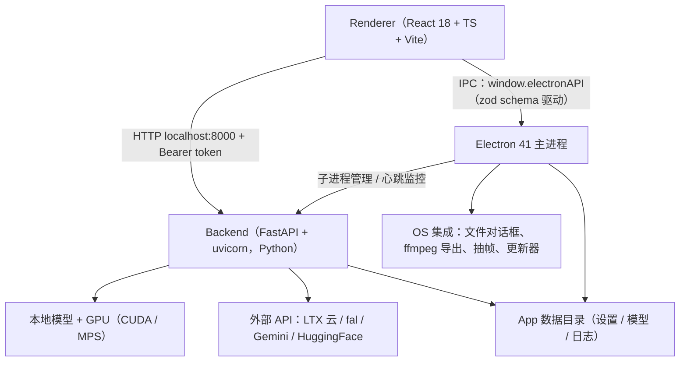

[LTX-Desktop](https://github.com/Lightricks/LTX-Desktop) 是 **LTX 视频模型的自家厂牌 Lightricks 开源的桌面应用**（Apache-2.0），2026-03-04 建仓、03-05 发 v1.0.0，到 2026-08-26 的 v1.2.7 一共发了 12 个版本，目前 1987 stars / 421 forks，官方标注 Beta。它的定位一句话说清：**在本地 NVIDIA 显卡或苹果芯 Mac 上跑 LTX-2 系列模型生成视频，硬件不够就整 App 退化为 API 客户端**——本地默认 LTX 2.5 Fast，可切 LTX 2.3 Fast；Pro 档只在云端。

> **一句话评价**：这是我最近读过的最有「本地大模型工程学」味道的仓库。它不发明任何模型，但把「22B transformer 如何住进 16GB 显存」「25GB 文本编码器如何外包给免费云 API」「上游推理库的显存坑怎么用可退场的补丁修」这三类问题各给了一套可抄的答案；而它自带的 NLE 视频编辑器 + Retake/take 系统，又让「生成」和「剪辑」在同一个项目文件里闭环。

这篇笔记把它的功能地图和每个功能的实现完整拆一遍。所有细节读自 v1.2.7 源码（浅克隆逐文件精读 + 两轮目录级扫描），数字均为一手核对；文末附仓库元信息速览。

## 一、总体架构：三个进程，两条通信线

LTX-Desktop 是标准的 Electron 壳 + Python 芯，但通信契约做得比大多数同类认真：

几条值得记的实现决策：

- **前后端契约是 OpenAPI 门禁化的**。后端 `export_openapi_schema.py` 导出 schema，`openapi-typescript` 生成 `frontend/generated/backend-openapi.ts`，前端 `api-client.ts` 在这之上包出 `{ok: true, data} | {ok: false, status, error}` 的结果类型；CI 里 `openapi:check` 会 `git diff --exit-code`，契约漂移直接挂构建。这套「后端单一事实源 → 类型自动流到前端」的做法在任何 Electron + Python 项目里都值得抄。
- **Renderer → Electron 走「schema 驱动」的 preload**。`shared/electron-api-schema.ts` 用 zod 定义了全部 60 多个 IPC 方法（`getBackend`、`exportNative`、`extractVideoFrame`、`checkGpu`……），preload 遍历 schema 把每个 key 变成 `ipcRenderer.invoke(key, input)`，类型和运行时校验一份代码搞定。安全上 renderer 沙箱全开：`contextIsolation: true`、`nodeIntegration: false`。
- **生成请求是同步长 POST + 500ms 轮询，没有 SSE/WebSocket**。`frontend/lib/backend.ts` 里留了一个 `backendWsUrl()` 函数，但全仓库零调用点——一个诚实的「我们试过没用上」化石。进度靠 `GET /api/generation/progress` 轮询，推理阶段的百分比在前端按预估时长（Pro 120s / 其他 45s）做 15%→95% 的插值，所以进度条是「演」的，但阶段名是真的（`validating_request` → `loading_model` → `encoding_text` → `inference` → `downloading_output`……）。
- **后端有自己的分层纪律**：`_routes/` 只做解析与转发 → `AppHandler` 持有共享锁和 `AppState`（用类型联合显式建模状态机，如 `GenerationRunning | GenerationComplete | GenerationError | GenerationCancelled`）→ `handlers/` 业务逻辑 → `services/` 副作用边界（每个服务 `Protocol + Impl + Fake` 三件套，测试注入 Fake、禁用 mock）。因为本地客户端就是重 GPU 单用户场景，路由全是同步 `def`，跑在 FastAPI 线程池里，锁的用法遵循「锁内做计划、锁外做重活、回锁核对再落账」。

还有一个反直觉的细节：**整个应用没有生成队列**。后端只有一个全局生成槽，前端用 `useGlobalGenerationLock` fail-closed 地把所有 Generate 按钮锁在一起——任何恢复标记、轮询中、轮询失败都算忙。

## 二、硬件探测与三档模式决策：一段 130 行的「能力路由」

本地还是上云，不是用户选的，是 `backend/runtime_config/runtime_policy.py` 里一个纯函数 `decide_local_generation_mode()` 决定的，输出三档：

| 平台 | 判定输入 | 不支持 | 流式（streaming） | 全驻留（full resident） |
| --- | --- | --- | --- | --- |
| Windows / Linux + NVIDIA | 总显存 | <15GB | 15–31GB | ≥31GB |
| ROCm（Linux A 卡） | 同上 | <15GB | **任意显存都流式** | 无此档 |
| macOS 苹果芯 | **可用**（free）内存 | <15GB | 15–85GB | ≥85GB（注释自曝：真机未验证） |

这段代码的注释密度是全仓库最高的，几乎每行数字都有出处，值得摘几条：

- CUDA 全驻留档的前提是 **fp8 量化把 22B transformer 从 42–46GB 压到约 23GB**，所以 31GB 显存才敢设为门槛；ROCm 没有 fp8 路径（`fp8_capable=False`），硬塞 46GB bf16 会在原本的门槛上 OOM，于是无论多大显存都强制流式——这个例外是社区 PR #160 贡献的。
- 苹果这边的输入是 **free RAM 而非总内存**：统一内存里 OS、Electron、App 自己已经吃掉一块，总量会高估余量。85GB 全驻留门槛的推导写在注释里：transformer 42.98GiB + Gemma 文本编码器 23.28GiB + VAE 与激活约 7.3GiB（注释老实承认「估计值，未验证」）= 73.5GiB，再加 15% 的分配器碎片余量。而这条注释的由来是一次真实事故：48GB 机器上 free 19GB 被分到了全驻留档，结果既不崩溃也不报 OOM，就是**安静地卡死在换页里**——「这个失败模式不会自我宣告，测试里根本注意不到」。
- 这个检查**只在启动时跑一次**（Python 后端进程拉起时），README 专门用一段科普「开着 App 释放内存没用，要退出重开」。

三档模式对应两套权重供给策略（`services/ltx_pipeline_common.py` 的 `offload_mode_for_prefetch_count()`）：

- **CUDA 流式**：`OffloadMode.CPU`——权重 pin 在主内存里，按层预取搬进显存（`prefetch_count=2`）；
- **MPS 流式**：`OffloadMode.Disk`——权重留在磁盘上 mmap 流式过一块约 5GB 的 pinned buffer。不能学 CUDA 把 46GB pin 进主内存，因为苹果的「显存」就是这同一块内存，pin 了等于没省。

探测本身（`services/gpu_info/`）也是两段式：**torch 定能力，pynvml 定遥测**——`torch.cuda.is_available()` / `torch.backends.mps.is_available()` 决定档位，显存名称/总量/占用走 NVML 拿（不依赖 `nvidia-smi` 子进程）；MPS 上用 `sysctl` 报芯片名、把统一内存总量报成 "vram"，`psutil` 的可用内存才是门槛指标。

## 三、本地推理核心：ltx-core + ltx-pipelines，22B 蒸馏模型

本地生成不依赖 diffusers（diffusers 只用于 Z-Image 生图），而是用 Lightricks 自家 **LTX-2 仓库里的 `ltx-core` 1.2.0 + `ltx-pipelines` 1.2.0**（按 git tag 从 `Lightricks/LTX-2` 的子目录安装，`pyproject.toml` 里还留着注释：升级前必须逐个复查 `services/patches/` 里的 monkey-patch）。

模型组件（`runtime_config/model_download_specs.py` 声明，下载后放 `models/`）：

| 组件 | LTX 2.3 Fast | LTX 2.5 Fast |
| --- | --- | --- |
| transformer | 单体 checkpoint `ltx-2.3-22b-distilled-1.1.safetensors`（46GB，含 VAE 和 DurationHead） | 拆分式 `ltx-2.5-22b-distilled-transformer-bf16.safetensors`（约 42GB，**HF gated**） |
| 文本编码器 | gemma-3-12b-it-qat-q4_0-unquantized（约 25GB） | gemma4-12b-with-proj-ltx-2.5-bf16（带 LTX 投影层，gated） |
| VAE | 单体内含 | 独立三个：video VAE / conv VAE / audio VAE，另有 duration-head |

推理细节里几个值得记的：

- **蒸馏模型的 sigma 是写死的**：`DISTILLED_SIGMA_VALUES` / `STAGE_2_DISTILLED_SIGMA_VALUES` 常量直接给定采样表，不需要 scheduler 搜索——这是蒸馏模型「快」的来源之一。帧数被网格约束为 `(n-1) % 8 == 0`、最少 9 帧（latent 8 倍时间下采样）；时长还可以交给 DurationHead 头自动决定（`AutoDuration`）。
- **fp8 量化是按 checkpoint 生成策略的**（`ltx_core.quantization.fp8_cast.build_policy`），只对真 CUDA 生效，MPS 全程 bf16。
- **全局注意力替换成 SageAttention**：`ltx2_server.py` 启动时把 `F.scaled_dot_product_attention` 整个 wrap 掉——4 维输入、head dim ∈ {64, 96, 128} 的 query 走 `sageattn`，其余回落原生 SDPA，并用 `@torch.compiler.disable` 防止 torch.compile 把形状烤死。Windows 的 SageAttention 轮子来自社区 `woct0rdho/SageAttention` v2.2.0（cu128 / sm120 Blackwell 内核）。一个配套补丁 `natten_libnatten_gate.py` 会在 natten 只有 Flex-attention 版没有原生库时把可用标志翻回 False，让 DiffVAE 老实回落 Triton。
- **VAE 解码是分块的**：`AUTO_TILING` 按当前空闲显存自动选 tile 尺寸；解码前会先把常驻的 transformer 驱逐掉腾地方（这块的坑见第七节补丁故事）。
- 设置里有两个默认关闭的性能开关：`use_torch_compile`（用 `CompilationConfig` 重建管线）和 `diffusion_stage_cache_enabled`（实验性的 transformer 单槽缓存，见下节）。

## 四、模型下载：HF Hub 的「进度注入」与原子落位

下载层没有自造轮子，是 `huggingface_hub` 的 `hf_hub_download` / `snapshot_download` 薄封装，但补了两块桌面端必需的体验：

- **进度条是 monkey-patch 出来的**：直接替换 `huggingface_hub.file_download` 里的 `http_get` **和 `xet_get`**，注入一个视觉禁用的 tqdm 子类——多个文件的进度条共享一个锁保护的 `{downloaded: …}` 字典，聚合成总字节数回调给 UI。断点续传和完整性校验完全继承自 HF Hub（etag / xet 分块 / `.incomplete` 残留文件）。
- **原子落位**：先下到 `models/.downloading/` 暂存目录，完成后 `Path.replace()` 一步进位，避免半截文件被模型扫描器当成已就绪。
- **gated 模型走 HF OAuth**：LTX-2.5 全家在 HuggingFace 上是 gated repo，App 内置 OAuth 客户端完成登录 + 接受协议，license 文本实时从 HF 拉取展示。首次启动的引导流就包含这一步。

顺带一提磁盘账本：Windows 本地生成要求 **160GB+ 可用空间**（模型 + Python 环境 + 输出），这个数字在 README 里用加粗标出，是有诚意的。

## 五、文本编码双通道：免费云端 API 与一个白名单 pickle 反序列化器

这是全仓库我觉得最聪明的一个设计。LTX-2 的 prompt 不是一个字符串，而是 **Gemma 12B 编码出的张量**——本地常驻要多花约 25GB 内存/磁盘。Lightricks 的解法：把文本编码做成官方云 API 且**完全免费**（`POST https://api.ltx.video/v1/prompt-embedding`），本地模式也强烈建议用；不想联网的用户才下载本地 Gemma（设置项 `use_local_text_encoder`）。

实现上最好玩的是**响应格式**：云端返回的是 **torch 张量的 pickle**。`services/text_encoder/ltx_text_encoder.py` 里为此写了一个 `_CpuUnpickler`——白名单只放行 4 个 pickle 全局（`_rebuild_tensor_v2`、`_load_from_bytes`、`OrderedDict`、`_codecs.encode`），并把 storage 一律重定向到 CPU（否则无 CUDA 的机器反序列化会炸）。拿到张量后在 dim=4096 处切开：前半是 `video_context`、后半是 `audio_context`，转 bf16 进管线。用哪个云端模型，是从本地 checkpoint 的 safetensors `__metadata__["encrypted_wandb_properties"]` 里读出来的（2.5 起改为显式 `{ltx_version, gemma_version}` 选择器）。

而「本地没下 Gemma」这件事，是靠三个 monkey-patch 对上游 `PromptEncoder` 做的外科手术：`__init__` 在 `text_encoder_path` 为空时短路；`__call__` 直接返回缓存的 API 嵌入（负向提示词之类的额外 prompt 补零占位）；内存清理前先把文本编码器挪去 CPU。云端做增强的版本还有一个附带好处：API 编码是**同一次调用里服务端顺便重写 prompt**，本地路径才需要单独跑增强器（见第八节）。

## 六、生成功能逐个拆

前端 GenSpace（一个 3500 行的 React 组件）把生成分成六个显式 mode：`image | video | multi-keyframe | retake | extend | ic-lora`。注意 **文生视频 / 图生视频 / 音生视频不是独立 mode**，而是 `video` mode 由「挂了什么输入」派生出来（`videoGenerationModeFromInputs()`：有关键帧→multi-keyframe、有音频→audio-to-video、有图→image-to-video、都没有→text-to-video）。

### 6.1 文生 / 图生视频与多关键帧

基础管线是 `ltx_pipelines.distilled.DistilledPipeline`，图像条件统一为 `ImageConditioningInput(path, frame_idx, strength)`。单图 i2v 就是 frame 0 替换 latent；**多关键帧**才是有意思的部分：

- **帧网格**：关键帧落在 `0..lastFrame` 的整数帧索引上，`lastFrame = floor(duration * fps / 8) * 8 + 1 - 1`，时长/帧率变化时 `retimeKeyframes()` 把所有关键帧**等比缩放**重新分布。
- **强度**：每个关键帧一个 `[0, 1]` 的 strength（默认 0.7，UI 上是叠在缩略图旁边的竖条滑杆 + 方向键 5% 步进），1 表示完全锁定该帧。
- **实现核心是一个 guiding-latent 交换补丁**：上游蒸馏管线默认只有 frame 0 参与条件替换，`services/fast_video_pipeline/distilled_keyframe_guiding.py` 提供一个加锁的上下文管理器，临时把 `combined_image_conditionings` 换成 `image_conditionings_by_adding_guiding_latent`（引导而非替换），让**每个**关键帧都参与引导。本地最多 10 个关键帧（`LOCAL_MULTI_KEYFRAME_MAX_COUNT`，API 模式为 0）。
- **交互细节**：拖拽放帧时 `pickFreeFrameIndex()` 选最宽空闲段的中点避让碰撞；时间码 `MM:SS.FF` 可直接键入；空隙播放时预览显示「最后一个已过关键帧」。
- **尾帧输入**（last frame）只在 video mode + 有首帧 + 时长已定（非 auto）时出现——这些条件逻辑有整组的 colocated 单测（`genspace-last-frame.test.ts` 等 14 个 node:test 文件）。

### 6.2 音生视频（a2v）：冻结的音频 latent 与两阶段精修

`DistilledA2VPipeline`（两阶段蒸馏音生视频管线）的音频注入是 **latent 域的，不是时间戳对齐**：

1. 音频文件解码后用**音频 VAE** 编码成 latent，pad/trim 到 `AudioLatentShape`（channels=8、mel_bins=16）；
2. 作为 `ModalitySpec(context=audio_context, frozen=True, noise_scale=0.0, initial_latent=音频latent)` 注入——**冻结 + 零噪声**，去噪过程不许碰音频 token；
3. 两阶段出片：第一阶段半分辨率生成，`VideoUpsampler` 2 倍上采样，第二阶段全分辨率精修；
4. 最终成片**混回原始波形**（不是 VAE 解码出的音频），按 `num_frames / frame_rate` 截齐采样数。

### 6.3 Retake：时间区域掩码「重拍」

Retake（对已有视频的指定片段按 prompt 重生成）是 `ltx_pipelines.retake` 的一个**有意分叉**（分叉清单写在模块 docstring 里）：

- 源视频不能用单趟 VAE 编码——会 OOM，改用**分块编码**（`TileSizeConfig(frames=(24,16), height=(256,64), width=(256,64))`）；解码同样分块。
- 重生成窗口表达为 `TemporalRegionMask(start, end, fps)`，同时挂在视频和音频两个 `ModalitySpec` 上：**窗口外的 latent 全部冻结为上下文**，模型只重画窗口内。
- 蒸馏档用 `SimpleDenoiser` + 固定 sigma；2.5 checkpoint 额外换 **ancestral 采样器**（`EulerAncestralDiffusionStep`）；由于 checkpoint 里有自定义 autograd 函数，装饰器从 `@torch.inference_mode()` 退回 `@torch.no_grad()`。
- 三种粒度：`replace_audio_and_video / replace_video / replace_audio`。本地只有 2.3 支持 Retake（2.5 本地无），云端 Retake 走 `POST /v1/retake`（同步、600s 超时、422 安全拒绝单独处理）。

### 6.4 Extend：latent 时间维补零 + 接缝羽化

延长视频（前/后各可延长若干秒）是 Retake 的邻居：把视频 latent 沿时间维**零填充**出新区域，只重生成新区域，并且用 0.5 秒的 `MASK_DELTA` 把掩码**向保留侧多羽化一段**——让新旧之间有个过渡带，而不是硬接缝（这个常数刻意与云端网关的 `MASK_DELTA_SECONDS` 对齐）。本地同样仅 2.3；云端走异步 v2：`POST /v2/extend` 拿 job_id，每 3 秒轮询，最长 600 秒。

### 6.5 文生图 / 图生图：Z-Image-Turbo 的双路径

图片生成用 Z-Image-Turbo：本地走 diffusers 的 `ZImagePipeline`（bf16、`guidance_scale=0.0`——蒸馏模型不需要引导；CUDA 上 `enable_model_cpu_offload()`，MPS 上干脆常驻统一内存），编辑复用同一套组件的 `ZImageImg2ImgPipeline`；API 模式（或本地用户主动开启）走 **fal**：`fal.run/fal-ai/z-image/turbo` 及其 image-to-image 端点（图片 base64 成 PNG data URI）。前端编辑与生成用不同的步数常量，编辑默认强度 0.6。

## 七、LoRA / IC-LoRA 生态：内置目录、ComfyUI 兼容与控制信号

### 7.1 内置 LoRA 目录

打包在 App 里的一份 JSON（`runtime_config/lora_catalog.json`）：**14 个风格 LoRA + 14 个 IC-LoRA 特效**。11 个是 LTX 官方出品且 HF gated（如 clean-plate、day-to-night、outpainting、deblur），其余社区贡献、明确标注「LTX 不背书」。每条含预览、使用说明、触发词、few-shot 增强示例和 HF 链接，一键下载到 `models/loras/<lora-id>/`（每个 LoRA 独立子目录，不与用户手放的文件冲突）。

自定义 LoRA 的兼容性规则（README 和代码一致）：

- 认定规则：文件位于名为 `loras`/`lora` 的目录，**或**文件名含 "lora"——所以「直接丢进 loras/ 子目录」是唯一可靠姿势，递归扫描。
- 支持 LTX-2/2.3/2.5 家族（都是 22B 蒸馏底座）；**ComfyUI 导出的 LTXV LoRA 键名自动重映射**（`LTXV_LORA_COMFY_RENAMING_MAP`）。
- 加载前只读 safetensors **header**（8 字节长度 + JSON，不加载张量）校验：若没有打到 `transformer_blocks.N.(attn|ff)` 的 `lora_A/B` 张量，就警告并静默跳过——「不匹配的 LoRA 无效但不报错」是一条刻意的产品决策。

### 7.2 IC-LoRA：两阶段、128 倍数画布与绿幕外扩

IC-LoRA（in-context 效果，如 3D 转真实、上色、去模糊、水模拟）的管线是两阶段：stage 1 永远在画布一半分辨率跑，`VideoUpsampler` 放大 2 倍后 stage 2 精修。**画布必须是 128 的倍数**——不是玄学：stage 1 的画布要除以 2，其 32 倍下采样的 latent 还得是偶数，2 倍 patchify 才能整除。

条件机制是把**参考视频 VAE 编码后作为 conditioning** 输入；outpaint 类效果还带一张 attention mask（cv2 读一帧、归一化、`expand` 广播到 `(1,1,F,H,W)`，白=保留、黑=填充）。用户侧的预处理（`ic_lora_preprocessing.py`）很朴素但讲道理：单图重复成帧（帧数吸附到网格）、外扩时把源画面居中放在**chroma 绿幕**画布上——注释直说这是「训练分布」。

高级覆盖项：`skipStage2`、`useLoraInStage2`、`resolutionFactor`、`audioMode`、`loraStrength`、`fpsOverride`。其中 `use_lora_in_stage_2` 是把上游 PR #494 移植成了本地补丁（stage 2 保留 LoRA + 以视频而非仅图片为条件），并且第一次用到时把 stage 2 重建为**流式 DiffusionStage**——全分辨率参考视频的编码会让注意力序列长度翻倍。

### 7.3 控制信号：深度、姿态、边缘

三类控制视频都为 **union-control IC-LoRA**（`ltx-2.3-22b-ic-lora-union-control-ref0.5`）服务，且仅限 2.3：

- **深度**：Intel MiDaS DPT-Hybrid（`transformers.DPTForDepthEstimation`），min-max 归一化后用 `cv2.COLORMAP_INFERNO` 伪彩色；
- **姿态**：DWPose TorchScript（`dw-ll_ucoco_384_bs5`，288×384、batch 5）+ YOLOX-L 行人检测（640×640、conf 0.3），按 OpenPose 风格渲染彩虹骨架 + 手部 HSV 色相 + 面部点，还合成一个人造「脖子」关键点；
- **边缘**：Canny（阈值 100/200 + 64px 边缘 replicate padding 对齐训练分布）。

视频处理层（`services/video_processor/`）统一用 OpenCV 而非 ffmpeg 子进程，也是 IC-LoRA 预处理的公用底座。

## 八、提示词增强：catalog 感知的「触发词保真」设计

增强器（Enhance 按钮）有两个 provider：本地 Gemma（2.5 用 `google/gemma-4-E2B-it` 约 10GB 的**生成式**模型——编码用的 `gemma4_unified` 只能编码不能生成；2.3 时代留下的 Gemma 3 可作 fallback）或 Gemini API（默认 `gemini-3.5-flash-lite`，按模型分派 thinking 配置：Gemini 3 给 LOW、2.5 Flash 给 0、2.5 Pro 给最小 128；安全拦截映射为 422）。

设计上有三个亮点：

1. **catalog 感知**：系统提示词内嵌所选 LoRA/IC-LoRA 的目录块（描述、指令、触发词位置规则、few-shot 示例），重写者「知道」这个风格需要什么咒语。
2. **触发词的确定性保真**：自由重写路径后处理有 `enforce_trigger_placements()`——LLM 忘了触发词就按目录声明的位置（前缀/后缀）在词边界上**确定性地补上**，不赌模型自觉。另一条模板路径更彻底：LLM 只产出模板占位符的 JSON 值，固定脚手架文字由代码缝合，LLM 碰不到。
3. **专用系统提示词对齐训练分布**：关键帧插值用「静帧是 ground truth」的措辞；2.5 的音画描述直接复用 `ltx_core` 的训练系统提示词；i2v 时关键帧在消息里被标注成 `Keyframe 1: frame 48 (2.00s), strength 0.8`，让重写者知道身份锁多强。

为什么增强在 2.5 上近乎必选？`video_generation_handler.py` 的 docstring 给了官方解释：2.5 的训练分布在 **150–220 词的音画描述段落**上，用户手打的短 prompt 落在分布外，「模型会自己编剩下的」。所以 t2v 默认开增强、i2v 默认关（设置项分开）。还有一个实现八卦：本地增强**没有**用上游的 `enhance_t2v`，因为上游把 prompt 右 padding 到 8 倍数再 `.generate()`，会弄花 decoder-only 模型的输出——这是读源码才能知道的「为什么重写了一遍」。

## 九、自研 NLE 视频编辑器：gap fill、take 系统与 rAF 播放引擎

编辑器不是一个「预览器」，是认真的剪辑台：

- **状态层**：每个打开的编辑器一个 zustand vanilla store（非全局），React 侧 `useStoreWithEqualityFn` 订阅；`editor-actions.ts`（2600 行）里约 **90 个纯 reducer**（移动/裁剪/slip/slide/分割/变速/倒放/透明度/翻面/调色/文字叠加/交叉溶解/轨道锁定静音独奏/箱管理/字幕/take），`setStateWithHistory` 推 undo 快照（上限 50 步）。工具集是 NLE 标配七件套：select / trackForward / blade / slip / slide / ripple / roll。
- **播放引擎**：rAF 驱动主时钟（状态提交 250ms 节流防 React 过载），每 clip 一个 `<video>` 元素按 `trimStart + (t - clipStart)/speed` 持续 seek，`playbackRate` 吃变速与倒放；音频是 `HTMLAudioElement` 池 + 前瞻预载（播放中 5s、暂停 1s）。**程序监视器是一个虚拟时间线合成器**，不是真渲染。
- **Gap fill（时间轴缺口填充）**：检测到轨道上 >0.05s 的间隙后，点缺口选模式（text-to-video / image-to-video / text-to-image）→ 模态框三联画展示「左邻尾帧 / AI 填这里 / 右邻首帧」（边界帧经 `window.electronAPI.extractVideoFrame` 以 512px 抽出，末帧帧这类「逆向生成再反转」的技巧写在 tooltip 里）→ **AI 建议提示词**：边界帧 + 邻居 clip 的 prompt 一起 POST `/api/suggest-gap-prompt`（Gemini），回填到输入框（可重分析）→ 生成的素材经 `insertGeneratedGapAsset` 原位插入缺口，音频还能同步落到音轨。导入素材没有生成参数时，同一接口还被用来**反向推导 prompt** 再生新 take。
- **take 系统**：每次 Retake / 重生成的产物是素材的一个新 take（`addTakeToAsset`），时间轴 clip 可随时切换 take——「重拍」语义贯穿生成与剪辑。
- **跨视图 handoff**：ProjectContext 里挂着 `genSpaceRetakeSource`、`pendingRetakeUpdate` 等交接状态，编辑器里点「去 GenSpace 重拍」，回来时待应用的 take 已在上下文里等着。

## 十、导出与互操作：主进程 ffmpeg 三步走

导出在 **Electron 主进程**里跑（渲染器沙箱不碰 ffmpeg）：①先用 `filter_complex_script` 把整条视频轨（缩放/信箱/字幕烧录）渲成中间 MKV（libx264 CRF16）；②音频单独走 PCM 混音 buffer（逐 clip 解码对齐到 raw s16le 再包 WAV）；③两路合成，按目标编码器出片——h264（CRF，中间产物直接 `-c:v copy` 免二压）、ProRes（`prores_ks` profile 0–3、`yuva444p10le`、PCM 音轨）、VP9（Mbps 码率 + Opus）。`exportCancel` 杀进程句柄。

Premiere / DaVinci 的 **FCPXML 与 XML 时间轴在渲染器里纯 JS 生成**，SRT 导入导出同侧完成——不依赖后端，也就不受 Python 环境影响。

## 十一、取消、恢复与 Python 环境分发

- **取消**：一个进程级 `threading.Event`（去噪线程不能去拿 AppState 的 RLock，这是选 Event 不选锁的原因）。`wrap_denoiser()` 把检查织进每个 transformer forward；**MPS 上用 `Event.wait(0.001)` 故意让出 GIL**——否则 Mac 上取消请求和健康检查都进不来（CUDA kernel 本身放 GIL，无需此招）。取消异常经 `__cause__/__context__` 链识别；已知缺口：VAE 解码与 ffmpeg 编码阶段取消不掉，对应代码会在 Stop 后删掉半成品文件。
- **刷新恢复**：生成开始前写 localStorage 标记（`ltx-generation-recovery`，带 baselineId/generationId 握手），页面刷新后靠标记恢复轮询；App 根组件挂一个 `useGenerationRecoveryWatcher`，项目没开着也能把完成的产物落库。全局 3 秒轮询被同一个标记门控——**空闲的应用一个网络请求都不发**。
- **Python 环境分发**是三类平台三套策略：macOS 把预构建 python-embed（含 mps-sdpa 预编译扩展）直接打进 resources（代码签名时 `signIgnore` 跳过约 2.5 万个非二进制文件，绕开 macOS 单进程 10240 个打开文件上限）；Windows/Linux 首启从 GitHub Releases 下载分卷压缩包，用 `python-deps-hash.txt` 做版本指纹，更新时**预下载到 python-next/ 暂存**、下次启动哈希匹配即整目录晋升——更新不等下载。
- 一个安全细节：Electron 侧用 **koffi FFI 调 `kernel32.SetDllDirectoryW("")`** 把 CWD 从 DLL 搜索路径剔除（Windows 经典 DLL 劫持面），Python 侧用一行 ctypes 做同样的事，两边互为兜底。

## 十二、12 个上游 monkey-patch：一部「本地推理踩坑实录」

`services/patches/` 是全仓库最有教育意义的目录。每个补丁模块都带「Remove once …（上游修复即删）」的退场条件，且启动时 assert 被替换的符号存在——上游重构会**启动即炸而不是静默失效**。挑几个有故事的：

1. **transformer 重建缓存**（实验性）：上游每个 diffusion stage 调用都会从磁盘重建 22B transformer——RTX 5090 上约 40 秒，一段 132 秒的生成里占 80 秒。补丁做单槽缓存（键 = 构建器内容 + 量化标识 + dtype/device），但**缓存域是单次生成**：早期会话级缓存在 32GB 卡上冲出 41.8GB 峰值。驱逐例程是 sync → `gc.collect()` → `.to("meta")` → `cleanup_memory()` 的组合拳，并有 `_in_use` 计数防止去噪中途误杀。
2. **DiffVAE 解码 tile 上限**：Windows 的 `mem_get_info` 在驱逐 transformer 后虚报约 30GiB 空闲，`AUTO_TILING` 据此选了个接近全帧的 tile，32GB 卡直接挂死。补丁把解码预算**硬顶到 8GiB**。
3. **MPS tile 预算**：上游只查 CUDA allocator，MPS 查出来是 0 →「放不下一块 tile」。补丁用主机内存填数，并强制 2 路宽度切分——因为 MPS 上 eager 模式的 K=11 邻域注意力在全宽时会**把尾部帧静默置零**。
4. **safetensors 元数据读取**：`safe_open` 会预留等于文件大小的写时复制 commit charge（22–46GB），Windows 直接报 1455「页面文件太小」。六处元数据读取全部改成 header-only 的 mmap。
5. **pinned pool**：Windows 上 `cudaHostRegister` 失败会留下粘性 CUDA 错误，fallback 路径又被误报成 CUDA OOM（22B checkpoint 要 pin 约 23GiB 主内存）。Windows 改用 pageable 内存。
6. **record_stream**：RTX 5090 + CUDA 12.8 + torch 2.10 的分配器损坏引发 access violation，补丁改为显式持有引用 + 逐层 CUDA 事件。
7. **MPS SDPA**：原生 MPS SDPA 会物化 S×S 注意力矩阵，Mac 冻死/被系统杀；补丁路由到 `mps_sdpa.sdpa_opt`，并且**故意不设回退**——「回退路径就是冻死路径」。

这份目录的存在本身就是论点：**在消费级硬件上跑前沿开源模型，「与上游推理库共处」是一项持续工程**，而把它做成显式、可审计、有退场条件的补丁集，比 fork 整个上游或者攒一个私有分支要健康得多。

## 十三、杂项但值得记

- **性能跑道**（`backend/performance_runner/`）：无头起后端 + dashboard，跑浸泡/泄漏测试、冷启动延迟、逐 GPU 的 VRAM 适配、输出完整性 A/B、全功能面 sanity 扫描——对着「App 实际发布的那个后端」跑，不是玩具基准。
- **遥测**：自托管端点 `ltx-desktop.lightricks.com/v2/ingest`，无第三方 SDK，只发版本/平台/随机安装 ID；默认开启、设置里可关，还支持首启前写 `app_state.json` 预关。
- **API 客户端的卫生**：GET 瞬断重试 3 次；日志里 `video_uri/image_uri/audio_uri/last_frame_uri/prompt` 一律脱敏；上传走 `POST /v1/upload` 换签名 URL 再 PUT。
- **相机运动词汇表**：云端 API 侧维护 `dolly_in/out/left/right、jib_up/down、static、focus_shift` 的映射。
- 仓库里同时有 `AGENTS.md`、`CLAUDE.md`、`.codex/`、`.cursor/`——一个明牌 AI 辅助开发的现代仓库形态。

## 十四、点评：这份仓库回答了什么问题

横向看，我最近读过的三样东西正好构成一组对照：[video-agent-kit 拆解](/posts/zcode-video-agent-kit/)解的是「**Agent 怎么可靠地操作视频**」（文件契约 + QC 证据链）；[MiniMax H3 Max](/posts/minimax-h3-max/) 解的是「**云端吞吐**」（35 倍并发、API-first）；而 LTX-Desktop 解的是第三个问题——**前沿视频模型如何真正住进一台消费级电脑**。它的答案拆开是：

- **分层居住**：fp8 量化、按显存分档的权重流式、分块 VAE、按需驱逐，22B 模型从「48GB 显卡专属」降到「16GB 显卡能跑」；
- **组件外包**：最重的常驻组件之一（25GB 文本编码器）整个免费外包给官方 API，且本地路线保留、pickle 白名单反序列化这种脏活做在明处；
- **产品闭环**：生成（GenSpace）与剪辑（NLE）共享 take 语义，Retake/Extend/gap fill 让「AI 生成」出现在剪辑工作的原位点，而不是两个割裂的世界；
- **诚实的工程**：三档决策的每个数字带推导注释（包括「未验证，别往下调」的自我警告），12 个补丁各带退场条件，Beta 声明和「大 UI PR 暂缓」的边界都写在明面。

局限也直说：Beta 且破坏性变更在即；单槽生成无队列、同步长 POST 的通信模型在弱网/长任务下并不优雅；Windows 路径上补丁最密（commit charge、cudaHostRegister、mem_get_info 三连），某种意义上它也是一份「Windows 上做本地 GPU 推理有多坑」的民族志；MPS 的全驻留档连作者自己都标注未验证。160GB 磁盘 + 16GB 显存的进门门槛，决定了它今天是给**愿意为本地生成付硬件税的爱好者**用的工具——但作为「本地大模型桌面工程」的参考实现，它的价值远大于一个 App。

## 附：仓库速览（2026-09-14 时点）

- 仓库：`github.com/Lightricks/LTX-Desktop`，Apache-2.0，Beta
- 时间线：2026-03-04 建仓，03-05 v1.0.0，08-26 v1.2.7（12 个 release）
- 热度：1987 stars / 421 forks / 69 open issues
- 体量：后端 Python 约 30+ handler/service 模块，前端 React，Electron 41 + FastAPI
- 本地门槛：NVIDIA ≥16GB VRAM（代码分界 15GB）或苹果芯 ≥15GB 可用内存；磁盘 160GB+
- 模型：LTX 2.5 Fast（默认）/ 2.3 Fast 本地，2.5/2.3 Pro 仅 API；transformer 22B（fp8 后约 23GB 常驻）
- 关键依赖：ltx-core / ltx-pipelines 1.2.0（git tag）、torch ≥2.3（cu128）、SageAttention、diffusers（仅生图）、Gemma 3/4 文本编码器
