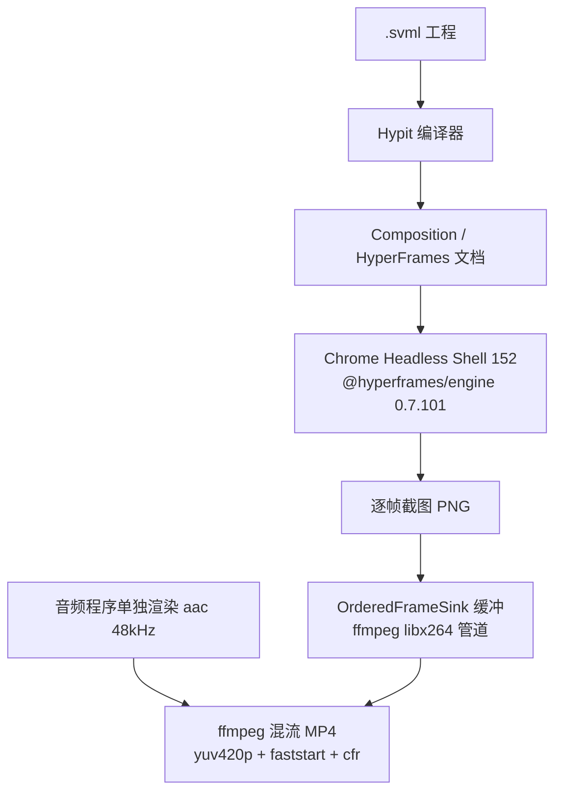

> 整理日期：2026-09-27
> 调研方式：两名 AI 调研员并行——一名对 [hypit-ai/hypit](https://github.com/hypit-ai/hypit) 仓库做浅克隆逐包源码核对（113 个包的依赖、LICENSE 逐条、示例工程、CLI 全部子命令），一名核查官网定价、媒体报道与社区口碑；star 数、npm 版本、`@hyperframes/*` 依赖锁定等关键数字均以 GitHub API 与 npm registry 当日实测为准。
> 写作动机：Hypit 是「coding agent 做视频」这条线目前最出圈的项目（两个月 16.5k star），而拆开源码发现它的渲染内核恰好是 HeyGen 开源的 HyperFrames——和我[平时那条 HyperFrames 生产线](/posts/ppt-to-video-vs-hyperframes/)同源，也与[数字人调研](/posts/digital-human-research/)、[剪映课程笔记](/posts/jianying-course-notes-1-prep/)那条线交叉，值得看清楚它到底是什么、边界在哪。

## 一、太长不看

**Hypit**（hypit.ai，GitHub `hypit-ai/hypit`）是给编码 Agent（Claude Code、Codex……）用的**视频创作「发行版」**：作者自创了一门 SVML 视频标记语言 + 编译器 + 运行时，Agent 写 SVML 工程，系统负责素材生成、字幕、合成与渲染。仓库原话："Clone any viral video with AI agents. Not just a script, the whole workflow: swap the face, the words, the B-roll, ship 100 variants in one command"。

最值得带走的五件事：

1. **核心抽象是「以词为锚」**——整条时间轴锚在 WhisperX 逐词对齐的语音上（"all anchored to words instead of seconds"），换文案后字幕、音效、闪屏、emoji 全部自动跟随新时间轴，这是「一条命令 100 个变体」的技术基础；
2. **渲染层不是自研**——源码证实它锁定 HeyGen 开源的 `@hyperframes/engine@0.7.101` + `@hyperframes/producer@0.7.101`，跑在 Chrome Headless Shell 152 里截帧、ffmpeg 封装；README 里的「64 个 headless Chromium 进程」是营销话术，代码实际按 CPU/内存自适应（约每 1.5GB 内存一个浏览器进程）；
3. **许可是「改装版 Apache-2.0」**——自己用、给客户做片子可以商用；但多租户托管、商业转售、去 LOGO 都须书面授权，且官方保留随时收紧或放宽条款的单方权利（贡献代码前想清楚）；
4. **真实成本结构是「模型便宜、Agent 贵」**——官方示例单条 20-30 秒视频模型费 $1.07-1.15；但第三方实测成本大头在 coding agent 本身：7 个任务把 $100 的 ChatGPT 套餐额度从 50% 用到 3%，一条 37 秒 1080p 视频耗费 1 小时 8 分钟 Agent 时间；
5. **「Hypit 整合剪映」是讹传**——全仓库代码搜索 `jianying`/`capcut`/`剪映`/`draft_content` 零命中（唯一沾边的是示例视频里一张 CapCut 品牌 icon）；实际是社区把 Hypit（拆解+素材）与剪映草稿生成 skill（`jianying-headless`、`pyJianYingDraft` 等）拼装使用。

## 二、它是什么，以及怎么突然爆了

作者在 Reddit 的原话交代了起源：*"This started with an editing problem. We were making content for AI companies, often taking an ad we liked and rebuilding it around a different product."*——给 AI 公司做投放内容时反复「拿一条喜欢的广告，换个产品重做一遍」，做着做着把这套流程做成了语言和编译器，命名 **SVML（Semantic Video Markup Language）**。作者原话："I called the language as SVML"，也就是说** SVML 是 Hypit 自创的 DSL，不存在独立的 SVML 标准组织**（svml.org 域名不存在）。

热度时间线（数字均为当日实测）：

| 日期 | 事件 |
| --- | --- |
| 2026-07-29 | 仓库创建 |
| 2026-09-15 | 约 2.2k star |
| 2026-09-14~20 | TrendShift GitHub 周榜第一 |
| 2026-09-17 | Lookonchain 报道称「8 天 16.6k star」 |
| 2026-09-27 | 16,569 star / 1,997 fork / v0.2.16 / 1,415 commits |

两个值得注意的信号：其一，**增长是一波流**——9/17 冲到 16.6k 之后十天几乎原地踏步，且 Hacker News 上至今零讨论，热度主要由 X/Reddit 短视频营销圈驱动；其二，**团队完全匿名**——组织 `hypit-ai` 2026 年注册，无任何创始人真名、融资披露，1,415 个 commit 里两位主力开发者占 96%（845 + 514），其余 19 人合计不超过 60 个。

工程本身的体量倒是不虚：TypeScript monorepo，`packages/` 下 **113 个 `@hypit/*` 包**（编译器、时间轴、各类轨道、模型 Provider、成本估算、凭据存储……），外加 3 个 Python 服务（WhisperX 转写对齐、OpenCV 图像处理、yt-dlp 下载），要求 Node ≥ 22.15。9 月 18 日到 26 日发了 10 个版本，接近日更。

## 三、SVML：以词为锚的视频 DSL

SVML 家族其实是三种文档（`skills/hypit/references/production/source-syntax.md`）：

- **`.svml`**——作品本体：剧本、素材生成、时间轴、轨道、渲染声明；
- **`.svs`**——Recipe，官方类比「CSS-like stylesheets for film, caption, media, text and generation settings」，成片风格与字幕样式抽离成可复用规则；
- **`.svrun`**——执行清单：声明这次跑哪些 target、复用哪些已生成素材。

看一段真实示例（`examples/interview/reference.svml`，街头采访风格的竖屏视频，节选）：

```xml
<?svml using="@hypit/markup@1"?>
<svml>
  <import as="seedance" from="@hypit/seedance@1"/>
  <import as="whisperx" from="@hypit/whisperx@1"/>
  <import as="interview-kit" source="@hypit/seedance-kits/street-interview"/>

  <script id="story">
    <manifest-rule>
      <BOY>Hey yo! || Is this || Lamborghini || yours?
      <WIFE>Mmm hmm.
      <BOY>Give me || three rules || to make your || first million.
      <WIFE>OK || the || first one || is || @{manifest!} Manifest.
```

剧本本身就是 DSL：`||` 标记节拍分组，`<2012 | twenty twelve>` 这种写法给读音备选，`@{manifest!}` 声明一个命名 Moment（后面音效、闪屏、emoji 全部挂在它上面）。再往下是 `<gpt:Image>` 生成角色肖像、`<fish:VoiceDesign>` 设计音色、`<seedance:ReferenceVideo>` 生成 A-roll、`<whisperx:SemanticTake>` 做词级对齐，最后各类轨道（字幕、音效、闪屏、emoji）全部 `at={story.moment.xxx}` 挂到**词**上，交给 `<render:Video>` 出片。

「以词为锚」是理解 Hypit 的钥匙。官方 timing 文档说，每个 SemanticTake 输出包含 *"every authored word's local frame window, and all of that Segment's structural anchors. There are two anchors for the Segment and two for each word"*。这意味着：**换掉文案重跑，所有动效自动对齐新的语音时间轴**——传统剪辑里改一句词要手工重拖所有字幕和卡点，这里结构保持、时间重排。这正是「clone 爆款」的实际含义：克隆的是**结构关系**（切点响应什么词、画面回答什么问题），不是搬运素材。

执行模型是图而不是顺序文档：*"Graph edges, not XML order, schedule execution"*，`.svrun` 里声明的 target 只会执行「被需求的子图」；已生成的素材作为 Run Candidates 被记录，改一个镜头重跑时其余素材直接复用——变体成本≈只付变化部分的模型费。

## 四、渲染管线：站在 HeyGen HyperFrames 的肩膀上

这是源码拆解里最有意思的发现。看 `packages/provider-hyperframes-local/package.json` 的依赖：

```
@hyperframes/engine    0.7.101
@hyperframes/producer  0.7.101
@puppeteer/browsers    3.2.2
（hypit 配置块：renderBrowser = Chrome Headless Shell 152.0.7928.2）
```

npm 上 `@hyperframes/*` 的仓库指向 **github.com/heygen-com/hyperframes**——即 **HeyGen 开源的 HTML 视频渲染引擎**（npm 最新已迭代到 0.8.80，我本机装的视频技能系统正是它）。所以完整渲染链是：



几个源码级的实话：

- **「64 个 headless Chromium 进程」是 README 三个示例里的文案**，代码里没有这个常数。实际并发是自适应的：`workers: auto` 时按 `min(核心数-2, 内存一半 ÷ 1.5GB)` 起浏览器，注释原话 *"Chrome owns raster surfaces, decoded media and the JS heap in separate processes. Leave half the memory and two CPU slots to the host"*，还会按实测帧吞吐动态增减（"extra browser did not improve throughput" 就回收）；
- 视觉、音频、混流是三个独立的需求（Need），由 Provider 实现，默认本地产物走上面的链路，理论上可换成云端渲染；
- 最终封装是常规的 `libx264 -preset veryfast` + `aac 48000 双声道` + `faststart`，帧级 `apad/atrim` 保证音画严格等长；
- 工程细节对 Windows 算友好：浏览器进程树清理用的就是 `taskkill`（`process-tree.ts`）。

对这个事实的解读：Hypit 真正自研且值钱的是 **SVML 语言层 + 语义时间轴 + Provider/成本管理这一整圈「导演系统」**，渲染内核是站在 HeyGen 肩膀上的。这也解释了为什么「编译出可编辑工程」这个理念能成立——底层本来就是文档式合成引擎。对已在用 HyperFrames 的开发者，Hypit 相当于在熟悉的渲染内核之上多了一层「素材生成 + 以词为锚 + 批量变体」的编排层。

## 五、CLI 与钱：把「花钱」做成一等公民

Hypit 的 CLI（`bin/hypit.mjs`）把付费生成的门禁做进了命令流：`check`（校验工程）→ `measure`（按语言/语速估时长，原话 *"measure spends nothing"*）→ `plan` / `pricing`（审阅端点与价格，在花钱授权之内）→ `build --follow`（执行）→ `result edit|finish|discard`（审片）。SKILL.md 给 Agent 立的规矩也很直白：*"Before paid work, establish the billing accounts, covered work and expected cost or budget the user accepts"*，以及 *"Done means watched."*——成品必须人看过才算完。

官方三个示例的物料账单（单条 20-30 秒竖屏）：

| 示例 | 内容 | 模型成本 |
| --- | --- | --- |
| GOAT DEBATE | UGC 排行榜：Seedance 2 Mini×2 段 A-roll + GPT Image 2×11 张图 + WhisperX + 卡拉 OK 字幕 | $1.15 |
| DAILY CREATINE | 播客切片：Seedance 2 Mini×3+1 段 + GPT Image 2×5 张 | $1.07 |
| NICE RIDE | 街访：Seedance 2 Mini×3 段 + GPT Image 2×1 张 + Google Video Intelligence/YOLOv8 头部追踪字幕 | $1.09 |

但注意模型矩阵是全量绑定的：Seedance、Seedream、GPT Image 2、Nano Banana、Grok Imagine、PixVerse、Wan、MiniMax H3、ElevenLabs、FishAudio……外加五个伙伴网关 Provider 和本地 Provider（whisperx/opencv/渲染）。免费只有一个层面：**框架本身零费用、无水印、成品归你**；生成模型的钱一分不少。

而第三方实测揭示了真正的成本大头。[VisionStory 的 7 任务评测](https://www.visionstory.ai/zh-cn/open-source/hypit)发现：模型费确实约 $1/条，但 **coding agent 本身才是碎钞机——7 个任务把 $100 的 ChatGPT 套餐额度从 50% 用到 3%**，一条 37.1 秒 1080p 新脚本视频耗费 1 小时 8 分钟 Agent 时间。给 Hypit 算账要把「Agent 订阅的隐性损耗」算进去。

## 六、许可证逐条看

LICENSE 标题就叫 "Open Source License"，自述 *"a modified version of the Apache License 2.0, with the following additional conditions"*——GitHub 识别为 `NOASSERTION`，**不是 OSI 意义上的开源**。关键条款：

1. **多租户服务（1a）**：未经书面授权，不得用源码或衍生品运营多租户环境或向第三方提供托管/SaaS。租户定义写得很细："one tenant corresponds to one workspace…Operating an environment in which two or more parties outside your own organization hold separate workspaces constitutes a multi-tenant service, **whether or not a fee is charged**"——免费给人用也算；
2. **商业转售（1b）**：不得有偿销售、授权或变相捆绑分发 Hypit 或衍生品。Fork 与公开发布允许，但必须沿用同一许可证且不得用于商业供给；
3. **LOGO 与版权信息（1c）**：CLI、运行报告、manifest 及一切派生用户界面里的名称/LOGO/版权信息不得移除或修改（除非这些界面不暴露给用户）；
4. **贡献者条款（2）**：官方 *"can adjust the open-source agreement to be more strict or relaxed as deemed necessary"*——保留单方改约权；你的贡献 *"may be used for commercial purposes, including…its cloud business operations"*——贡献归官方商用；
5. **输出物（3）**：*"The producer claims no rights in the content you create with Hypit…belong to you"*——成品干净，但第三方模型条款仍然各自生效（Seedance/GPT Image 的商用条款要自己过一遍）。

明确**允许**的：自己部署自己用、给本组织（含给客户交付）做商用内容、单租户部署。一句话总结：**对「用」宽松、对「倒卖」关门、对「贡献」不对称**——和 MuseTalk 那种「代码 MIT + 模型随便商用」的干净程度差一档，接近 Mongo/Redis 式的「源码可用」路线，商用嵌入产品前要细读。

## 七、商业化：HypiHub 积分与导流联盟

官网的变现路径是 **HypiHub**——官方托管模型网关，自述 *"an OpenAI-shaped API in front of two dozen generative-media vendors"*，把 WhisperX + 图像/视频/语音模型打包成积分计费（也支持 BYOK 自带 key 或混用）。订阅档位（年付价）：Starter $9.90/月（1,800 积分）、Pro $39.90/月（10,000 积分）、Ultra $99.90/月（27,000 积分）；加油包 $15/2,000 到 $130/20,000（不过期、订阅额度先扣）。模型单价随档位递减：Seedance 2.0 $0.11→$0.08/秒、Seedance 2.5 最高 $0.69→$0.46/秒、MiniMax H3 $0.10→$0.07/秒。

两个事实核查结论：

- 网传的「矩阵号计划：20 账号、每月 600 条视频、底薪 + CPM 分成」在官网全站（含中文定价页、quickstart、docs、changelog）**查无任何条款**，若存在大概率只在 Discord/微信群私域宣传，谨慎当真；
- 企业版入口 `/commercial/contact` 目前是占位页，原文 *"Commercial contact handling is not connected yet"*——B 端售卖通道还没接上。

README 里的「发布伙伴」（Watcha、TokenDance、Monid、HiAPI、Pollo AI、BeatAPI、AutoClaw）实为**导流联盟**：链接带 `?aff=hypit` 返利码，各自独立账号计费。顺带辟个谣：TokenDance（词元跳动）的 "Token" 指 LLM 词元不是代币，全项目查无任何代币/Web3/链上融资痕迹——一家链上分析网站（Lookonchain）报道它只是因为开了 AI agent 新闻流。

## 八、「整合剪映」：一次典型的事实核查

Lookonchain 9 月 17 日的标题是 *"Hypit integrates Jianying into Claude Code, enabling agents to create full videos"*——这大概是中文圈对 Hypit 最深的误解来源。**源码层面这是讹传**：全仓库搜索 `jianying`/`capcut`/`剪映`/`draft_content`，唯一命中是 `examples/complex-explainer`（一个 137 秒、17 个 Take 的成片）里一张 CapCut 品牌 icon 素材，和一句台词「让 AI 操作剪辑软件」——而且这句台词在片子里是用来**对比** Hypit 的编译路线的。Hypit 官方唯一的导出面就是 MP4（`render:Video` + `hypit get`），没有任何剪映草稿（draft_content.json）写出能力。

「Hypit × 剪映」的真实形态是**社区拼装**：Hypit 负责拆解参考视频与生成素材，再由剪映草稿工具把结果落成剪映内可编辑的工程——这条生态里有 `jianying-headless`（结构化 JSON 剪辑计划 → 可编辑剪映草稿）、`pyJianYingDraft`（Python 草稿生成，支持模板替换）、`capcut-cli`，以及 X 上流传的「Hypit + 剪映编辑 skill」组合工作流。理念上确实同源（产出可编辑工程而非死视频），但它是拼出来的，不是 Hypit 的官方功能。

## 九、口碑、竞品与适用边界

第三方实测的共识画像：

- [UPGPTs 教程](https://upgpts.com/en/tutorials/tools/hypit)（用 MiniMax H3 给 15 秒素材换吉卜力风格）：**字幕默认会丢，必须在 prompt 里显式要求**；质量「日常够用但不足以作为成片发布」；agent 说 done ≠ 真能用；
- [VisionStory 7 任务评测](https://www.visionstory.ai/zh-cn/open-source/hypit)：动效复刻/换装/风格迁移都站得住，最惊艳的是「外科手术式」替换——用 Blender 代码渲染替换科技评测里的多米诺镜头，完全跳过视频模型；最弱的是电影感重制（AI 味明显）。评分：上手难度 2/5、克隆质量 4/5、**轻度创作者性价比 2/5**；
- [掘金实操文](https://juejin.cn/post/7687521521469440041)：SVML 工程可进 git、可 diff、可分支，「决定了改稿是半小时还是三十秒」；同时提醒装 Skill ≠ 有生成额度、许可证非 MIT 商用需细读、**复刻结构 ≠ 搬运素材**（版权责任全在用户）。

竞品坐标：**Remotion**（React 编程式视频，个人及 ≤3 人团队免费、4 人以上公司要买 Company License、企业版 $500/月起）已官方转向 agent 优先（"Turn your idea into a video using your coding agent"），是这个赛道最成熟的对手；**HyperFrames**（HeyGen 开源）是 Hypit 的渲染内核，本身也带完整的 agent skill 体系，走 HTML/CSS 路线、不主打克隆爆款——我此前[实测过它与 PPT 管线的取舍](/posts/ppt-to-video-vs-hyperframes/)；托管式 AI 视频工具（几分钟出片、订阅制）适合「当天要成片」的用户，与 Hypit 的差异在参考视频起点 + 可重跑工程 + 批量变体。

什么时候该用 / 不该用：

- **该用**：有明确变现目标的批量结构化内容（投流广告、矩阵变体、多语言本地化），团队本来就有 coding agent 订阅和开发者工作流，愿意为「可 diff 的视频工程」付出学习成本；
- **不该用**：偶尔做一条片的轻度用户（托管工具更快更省）；要写实电影感成片（合成感明显）；要做口播数字人（那是 [MuseTalk 那条线](/posts/musetalk-deep-dive/)的主场）；想拿它做 SaaS 转售（许可证直接关门）。

顺带一提它的安装路径很轻：`npx skills add hypit-ai/hypit -g` 装 skill，项目里 `hypit doctor` 体检、`hypit capture install-browser` 拉渲染浏览器，HypiHub 或 BYOK 二选一——不用 clone 仓库。

## 十、参考链接

- [hypit-ai/hypit](https://github.com/hypit-ai/hypit)——官方仓库（本文架构、CLI、许可证、示例成本均出自源码与 README 原文，v0.2.16）
- [hypit.ai 定价页](https://hypit.ai/commercial/pricing)——HypiHub 积分与模型单价
- [hypit.ai 服务伙伴文档](https://hypit.ai/guide/service-partners/)——HypiHub 与五个网关 Partner 的边界
- [作者 Reddit 帖](https://www.reddit.com/r/coolgithubprojects/comments/1wi2o4b/built_a_language_that_lets_ai_agents_write_videos)——SVML 命名与项目起源自述
- [Lookonchain 报道](https://x.com/i/status/2100608465261457448)——「整合剪映」标题与 8 天 16.6k star 的出处（配套推文）
- [TrendShift 页面](https://trendshift.io/repositories/229030)——2026-09-14~20 周榜第一
- [VisionStory 评测](https://www.visionstory.ai/zh-cn/open-source/hypit)——7 任务实测与成本结构
- [UPGPTs 教程](https://upgpts.com/en/tutorials/tools/hypit)——MiniMax H3 改风格实操与踩坑
- [掘金实操文](https://juejin.cn/post/7687521521469440041)——安装到出片全流程
- [heygen-com/hyperframes（npm @hyperframes/\*）](https://github.com/heygen-com/hyperframes)——Hypit 渲染内核的上游
- [MiniMax-AI/MiniMax-H3](https://github.com/MiniMax-AI/MiniMax-H3)——教程所用 33B 全能多模态视频模型（开源权重）
- [Remotion](https://www.remotion.dev)——同赛道最成熟的编程式视频框架
- [pyJianYingDraft](https://github.com/GuanYixuan/pyJianYingDraft)、[jianying-draft 主题](https://github.com/topics/jianying-draft)——「Hypit × 剪映」拼装生态的底层工具
- 站内相关：[数字人方案深度调研](/posts/digital-human-research/)、[PPT 转视频路线实测与 HyperFrames 对比](/posts/ppt-to-video-vs-hyperframes/)、[白板动画 skill 横向实测](/posts/whiteboard-animation-skill-compare/)、[MuseTalk 深度拆解](/posts/musetalk-deep-dive/)
