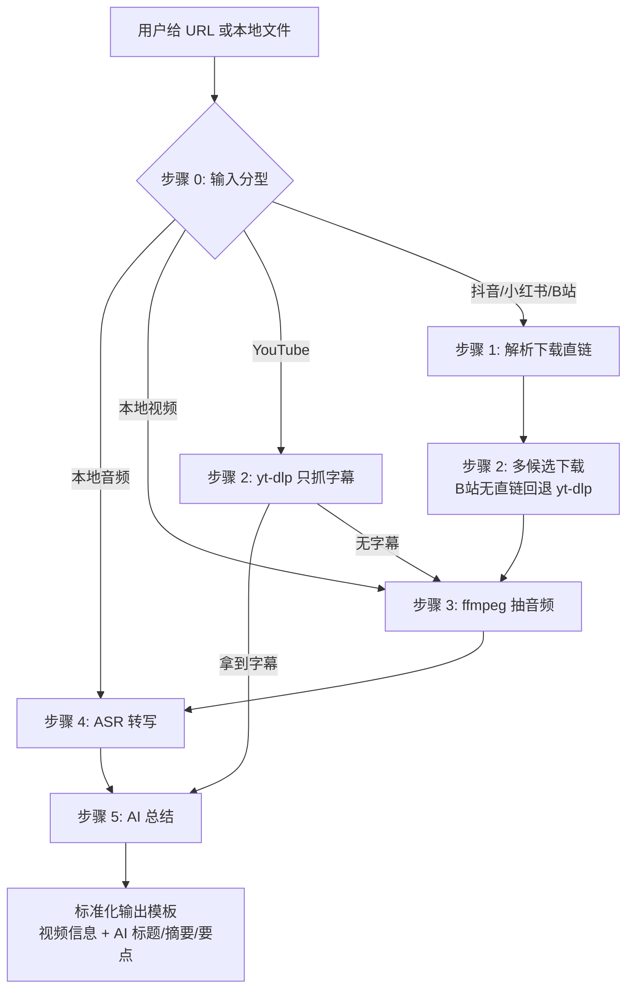

> 整理日期：2026-09-26
> 分析对象：[imlewc/video-to-subtitle-summary-skill](https://github.com/imlewc/video-to-subtitle-summary-skill)（commit `50598e2`，本地副本 `.tmp-video-skill-analysis/repo/`，MIT 协议）。文中所有 `path:line` 引用均相对仓库根，且已逐条人工核对原文。
> 分析方法：SKILL.md 与配置面 / scripts 与 tests / README 与 docs 三路并行分析 + 逐文件复核行号 + 亲跑测试套件（Windows / Python 3.11.5）。
> 姊妹篇：这篇和[《拆解 VideoTranscriptAPI》](/posts/videotranscriptapi-deep-dive/)是同一题材的两种形态——那边是「重服务 + skill 遥控器」，这边是「没有服务，一份 SKILL.md 指挥层 + 5 个可测脚本」的轻装范本，对照着看收获最大。

## 一、太长不看

这是一个面向 **Codex / Claude Code** 两类 Agent 宿主的本地 Skill，解决一个具体痛点：**把短视频（抖音/小红书/B站/YouTube）或本地音视频文件变成「字幕 + AI 总结」**，全程由 Agent 编排，不需要用户手动跑命令。

它最有价值的不是某个单点技巧，而是**「指挥层文档 + 可测脚本层 + 统一产物契约」的三层咬合**：SKILL.md 用自然语言实现了一台状态机（输入分型、条件跳转、预检、降级链）指挥 Agent 干活；复杂到不适合内联进 Markdown 的逻辑全部下沉到 `scripts/` 的 5 个纯标准库 Python 脚本；两层靠 `/tmp/video_analysis/{VIDEO_ID}/` 下的 `subtitle.srt` + `text.txt` 两个固定产物衔接——不管上游是 YouTube 字幕还是本地 ASR，末尾的总结步骤只认这对契约。

整体流程一张图：



---

## 二、仓库速览

- **定位**：本地 Agent Skill，宿主是 Codex / Claude Code；抖音/小红书/B站/YouTube 链接或本地 `.mp4/.mp3` 文件进，字幕 + AI 总结出；
- **架构**：指挥层 `SKILL.md`（583 行）+ 脚本层 `scripts/` 5 个 Python 脚本 + 配置层 `.env` + 文档层（双语 README + 四篇依赖指南）+ 测试层（5 个 unittest 文件 17 个用例，全部离线可跑）；
- **它要摆平的三个现实困难**，每个都给了结构性答案：
  1. 短视频平台没有公开下载接口 → 「视频解析代理」层：默认走作者运营的 AI Douyin 代理（top9.cc，按次扣积分），可切换自有 TikHub Token（`SKILL.md:221-328`）；
  2. ASR 方案多方案权衡（本地免费 vs 云端省事）→ 双后端开关 `ASR_BACKEND`（faster-whisper / 火山引擎，`SKILL.md:83-84、405-493`）；
  3. 宿主环境参差（有无 GPU、有无 Python 依赖、Codex 还是 Claude）→ 环境预检 + 安装 helper + 硬件自适应降级（`SKILL.md:136-219`）；
- **许可**：MIT；仓库只有一次压缩提交（`50598e2`），无法从提交历史回溯实施过程。

---

## 三、数据流：步骤即状态机

在线视频主线（步骤编号沿用 `SKILL.md:93-568`）：

0. **输入分型**：按域名识别平台（douyin / xhslink / bilibili|b23.tv / youtube，`SKILL.md:99-103`）；本地音频跳步骤 4、本地视频从步骤 3 起（`SKILL.md:104-106`）；
1. **解析下载直链**：YouTube 跳过；AI Douyin 走 curl+jq（`SKILL.md:236-292`）或自有 TikHub（`294-328`）；
2. **下载**：YouTube 用 yt-dlp **只抓字幕**（zh-Hans,zh-Hant,zh,en）→ `subtitle.srt` + `text.txt`（`SKILL.md:356-370`），**拿到字幕直接跳步骤 5**；其余平台 `download_video_candidates.py` 逐候选尝试（`376-384`），B 站拿不到直链回退 yt-dlp（`386-391`）；
3. **ffmpeg 抽音频**（`SKILL.md:398`）；
4. **转写**：方案 A faster-whisper 本地（`416-423`）/ 方案 B 火山引擎云端（`432-493`）→ 统一产出 `subtitle.srt` + `text.txt`；
5. **AI 总结**：由 Claude 直接读 `text.txt` 生成标题/摘要/要点（`495-534`）→ 套输出模板（`536-568`）。

关键设计一句话：**步骤之间以固定文件而非 shell 变量交接**。所有后端最终都收敛到同一对产物文件（`scripts/download_youtube_subtitles.py:111-112`、`scripts/transcribe_faster_whisper.py:183-184`），后端差异被隔离在中间层，末尾的总结步骤只依赖统一契约——所以 YouTube 有字幕时步骤 3/4 能整体短路。

---

## 四、提示词全解析

这个仓库真正「喂给 LLM」的成段提示词只有一处（步骤 5 模板），但围绕它有一整套提示词工程配套规范（触发器、上下文准备、裁决规则、输出契约、安全红线），合起来才是完整设计。

### P1 核心总结模板（全文唯一成段 LLM 提示词）

`SKILL.md:511-526`，原文关键段：

```text
以下是一个视频的分析素材，请基于这些信息生成总结：

原视频标题：{ORIGINAL_TITLE}
来源平台：{PLATFORM}
作者：{AUTHOR}
说明：下面的正文来自平台字幕、自动字幕或语音识别，可能存在少量识别误差、
断句问题或专有名词错误。请以原视频标题和上下文为参考，在不改变原意的前提下
做适度修正，再完成总结。

语音识别文本：
{TEXT_CONTENT}

请输出：
1. AI生成标题：简洁概括，不超过30字；可以参考原视频标题，但不要机械照抄，
   必要时可根据正文纠正明显错误
2. AI摘要：提炼主要观点和关键信息，200-300字
3. 核心要点：输出3-5条结构化要点
```

五件套手法：**变量槽注入**（`{XXX}` 占位与全文其他槽位风格统一）；**错误容忍前置声明**（先告知输入有 ASR 噪声再下任务，修正授权与边界同句写死——「在不改变原意的前提下」）；**结构 + 长度双重量化**（三段式 + 30 字上限 + 200-300 字区间 + 3-5 条区间）；**反机械照抄**（一条指令同时防照搬与跑题）；**分步引导**（先修正再总结，数据清洗与内容生成拆开）。对任何「有噪声输入 → 结构化输出」的下游任务（ASR、OCR、爬虫正文），这五招可整段搬走。

### P2 输入准备规范（喂模板之前的规矩）

`SKILL.md:501-507`：规定标题取哪个字段（抖音优先 `desc`、小红书/B站优先 `title`）、无标题怎么兜底（文件名/视频 ID）、必须声明什么噪声。**很多人写模板很用心，却忘了规定「槽位数据从哪来」**——这里把输入准备本身规范化了，且噪声说明与 P1 模板内声明互为双保险（一处写给 agent、一处写进提示词）。

### P3 标题-正文冲突裁决

`SKILL.md:528-530`：标题与正文明显冲突时——优先以正文主旨为准；保留「可能因语音识别存在误差」的判断；**不要凭空补充未出现的信息**。给提示词配这种「冲突仲裁条款 + 反幻觉红线」，成本两行，模型不再自行编造调和性内容。

### P4 触发词式 frontmatter description

`SKILL.md:3`：把 matcher 判据直接写进 description——枚举具体域名（v.douyin.com、b23.tv……）、文件扩展名（.mp4/.mp3/.wav）、意图短语；正文 When to Use 末尾还配负面声明——「**不适用于**：实时语音识别、直播字幕」（`SKILL.md:27`）。**正向管「何时触发」、负面管「何时不接」**，合成完整的 matcher 判据，这是低成本提升触发准确率的第一杠杆。

### P5 密钥卫生红线

`SKILL.md:296、350`：「不要把真实 Token 写入日志或回复」「输出给用户时不要展示真实 API Key」。代码层做日志脱敏（`scripts/download_video_candidates.py:44-48`）防的是日志文件，提示词层红线防的是 agent 把密钥复述进对话——**两道防线缺一不可**。涉及付费 API Key 的 skill 应当默认带这两条。

### P6–P9 一笔带过

**P6 输出模板与脚本产物逐一对齐**（`SKILL.md:536-568`）：模板里的文件路径与脚本写死的输出完全咬合，README 又用同构模板展示效果——提示词层、脚本层、文档层互相咬合而不是各说各话。**P7 FAQ 排查表**（`570-583`）：九类故障写成「问题 + 解决方案」双列表，本质是预写的错误恢复提示词，agent 遇到报错直接按表处置。**P8 用户唤起示例**：四平台各一条、中英各一套，唤起门槛降到零。**P9 计划文档的元提示词**：给执行 agent 的计划文档开头一句角色设定 + 流程指令，整份决策记录就能被 subagent 流水线逐任务消费。

---

## 五、SKILL.md 的编排设计：用自然语言写状态机

这一层是全仓库最有「作者味」的部分。

**步骤机与条件跳转**。步骤 0 分型后跳转规则写死（本地音频跳 4、视频从 3 起）；步骤 4 开头规定「YouTube 已成功生成 subtitle.srt 和 text.txt 则跳过本步骤」；步骤 1.5 历史查询是按需旁路。**控制流写进文档而非留给 agent 判断**——这是「用文档做编排」与「让 agent 自由发挥」的分水岭，不同会话的执行路径才可能一致。

**统一占位符契约**。全文档用 `{VIDEO_ID}/{PLATFORM}/{ORIGINAL_TITLE}/{TEXT_CONTENT}...` 大括号占位标记 agent 需替换的槽位，与脚本字面量明确区分。其中 `{INPUT_MODE}/{PLATFORM}/{NEEDS_FFMPEG}` 是预检脚本的**形参**——同一段检查代码按当前分支裁剪检查项，一段脚本服务多分支。

**自包含脚本片段：牺牲 DRY 换确定性**。`read_env` 函数在三段脚本中原样重复，`SKILL_DIR` 双路径探测在每个代码块开头重复——所有片段不依赖上一段建立的 shell 状态，**任何一段被单独复制执行都能跑通**。对以「逐块执行」方式消费文档的 agent，文本重复才可靠。

**预检前置 + 真实探针**。步骤 0.6 标题即「必须首先执行」；按上下文裁剪检查项（URL 模式才查 API Key/jq/yt-dlp，音频输入跳过 ffmpeg）；Python 依赖不是查二进制存在，而是 heredoc 里真的 `import faster_whisper`——能抓到「python 在但装错环境」的假阳性；失败输出一次性列出全部缺项 + 当前后端 + 合法可选值 + 修复指引。

**显式降级链**。每条主路径的失败出口都预先写好，而非隐式兜底：

| 主路径 | 降级出口 |
| --- | --- |
| YouTube 转写 | 有字幕就不跑 ASR；无字幕才下载走后端 |
| B站直链下载 | 回退 yt-dlp |
| AI Douyin 402 | 提示充值或切 `VIDEO_INFO_PROVIDER=tikhub` |
| GPU 不可用 | `FW_DEVICE=auto` 自动落 CPU |
| faster-whisper 未装 | 指向 install helper 自动装 venv |

**网络健壮性**：`curl -w '\n%{http_code}'` 把状态码与响应体分离落盘，402/401 分支给带修复动作的错误文案；API Base 兼容三种填写习惯自动归一。**跨宿主**：每段脚本先探测 `$HOME/.codex/skills/` 再回退 `$HOME/.claude/skills/`，一份文档同时服务两类宿主。

**分工线**：复杂逻辑（多候选下载、VTT 解析、硬件探测、镜像测速）全部下沉到 `scripts/` 并配测试；留在 SKILL.md 里的是「单发 curl + jq」级别的直线逻辑。有意思的是，计划文档原本倾向把 AI Douyin 解析也封装成 Python 脚本（plans:284-289），最终落地却回了 curl+jq 内联——这段 jq 链成了全文档最复杂、也最难测的片段（测试覆盖空白）。

---

## 六、值得学习的优点（按借鉴价值排序）

> ★★★★★ = 对自写 Agent Skill / 提示词的人可直接整段搬走。

| # | 手法 | 出处 | 价值 |
| --- | --- | --- | --- |
| 1 | **双开关正交架构**：能力开关（`ASR_BACKEND`）× 供应商开关（`VIDEO_INFO_PROVIDER`），各自独立配置、独立校验非法值——而不是 if-else 堆成一维长链 | `SKILL.md:83-84` | ★★★★★ |
| 2 | **环境预检前置 + 按上下文裁剪 + 真实 import 探针**，失败输出带缺项/当前值/合法值/修复指引 | `SKILL.md:136-219` | ★★★★★ |
| 3 | **固定产物契约跨路径同构**：YouTube 字幕路径与本地 ASR 路径产出完全相同的 `subtitle.srt + text.txt`，步骤 4 因此可以整体短路 | `download_youtube_subtitles.py:111-112` 等 | ★★★★★ |
| 4 | **核心总结提示词五件套**：槽位注入 / 噪声前置声明 / 结构+长度双重量化 / 反机械照抄 / 先修正后总结 | `SKILL.md:501-530` | ★★★★★ |
| 5 | **显式降级链写进步骤与 FAQ**：每条主路径都预写「失败了去哪」 | `SKILL.md:18,328,372,579` | ★★★★★ |
| 6 | **依赖注入缝让网络/硬件依赖可离线 mock**：opener 参数、probe 函数、模块形参——一个带默认值的关键字参数，换回可测性 | 5 个脚本均有 | ★★★★★ |
| 7 | **日志脱敏 + 测试锁定**：stderr 只打域名+扩展名，测试断言 `secret=token` 不出现 | `download_video_candidates.py:44-48` | ★★★★☆ |
| 8 | **HTTP 状态码/响应体分离 + 可操作错误文案** | `SKILL.md:260-279` | ★★★★☆ |
| 9 | **带条件跳转的步骤编排**（用文档实现状态机） | `SKILL.md:95-106` | ★★★★☆ |
| 10 | **硬件三级自适应降级 + 测试矩阵**：auto→CUDA 判定、compute type 按优先序回退、4 个单测锁 4 条路径 | `transcribe_faster_whisper.py:131-162` | ★★★★☆ |
| 11 | **纯标准库 + 重依赖延迟导入**：faster-whisper 用到才 import，ImportError 转成带 pip 指引的错误——`--help` 永不因缺依赖而炸 | `transcribe_faster_whisper.py:86-105` | ★★★★☆ |
| 12 | **.part 原子写入 + 跨候选 fallback + 错误聚合**：分块写临时文件、成功才 rename、失败清理换下一个 | `download_video_candidates.py:61-83` | ★★★★☆ |
| 13 | **决策记录与开放问题分离落档**（小型 ADR）：Confirmed Decisions 与 Open Questions 各自成节 | plans:409-419 | ★★★★☆ |
| 14 | **CLI 参数 > .env > 环境变量三级配置优先级** | 两个脚本两种实现位 | ★★★☆☆ |
| 15 | **触发词式 description + 负面范围声明** | `SKILL.md:3,27` | ★★★☆☆ |
| 16 | **表格式决策与领域路由**：外部依赖表、平台路由表、FAQ 表 | `SKILL.md:29-40` 等 | ★★★☆☆ |
| 17 | **SKILL_DIR 双路径回退跨宿主**（Codex / Claude Code） | `SKILL.md:113-114` | ★★★☆☆ |
| 18 | **计费语义三处一致**（成功扣 1 积分/失败不扣/402）：README、指南、计划文档口径对齐 | docs 多处 | ★★★☆☆ |
| 19 | **测试用 importlib 按路径加载被测脚本**：无需 `__init__.py`、无需 pytest，`python -m unittest discover` 即可 | 5 个测试文件同款 | ★★★☆☆ |
| 20 | **每个外部依赖一篇结构统一的配置指南**（步骤→验证 curl→费用表→FAQ），bytedance 指南专门标注 `Bearer;token` 分号无空格的反直觉陷阱 | docs/ | ★★★☆☆ |
| 21 | **直链下载带浏览器 UA 伪装**：固定 Chrome UA 注入每个下载请求头，并同步写进 FAQ | `download_video_candidates.py:15-18` | ★★☆☆☆ |

---

## 七、局限与反面教材

这个仓库的缺陷同样有借鉴价值——**「文档即程序」形态特有的 bug**：

**SKILL.md 内部一致性**：

1. **输出要求重复且措辞不一**：步骤 5 模板内已含输出规格（要点 3-5 条），冲突规则之后又出现一份重复清单且放宽为「结构化的列表」未限条数，agent 以哪份为准存在歧义——两段被冲突规则隔断，疑为改写残留；
2. **上下文缝隙**：输出模板要求「作者/时长」及 `{AUTHOR}` 槽位，但步骤 1 的字段提取从未指示从哪个响应字段取作者/时长——不同实现可能产出空值；
3. **`read_env` 的互斥语义**：`.env` 存在时只读 `.env`、完全忽略 shell 环境变量，与「支持以下任意方式配置」的表述有落差；对比 Python 侧的三级优先级，bash 侧反而是「.env 一票否决」；
4. **共享临时文件并发冲突**：步骤 1 的解析响应落盘在不在 `{VIDEO_ID}` 子目录内的共享路径，两个视频并行处理时会互相覆盖——建议落盘到各自的 `{VIDEO_ID}/` 下。

**文档与披露**：

- 中英 README 不同步（中文独有的部署章节、费用表宿主名称不一致等三处）；
- 利益关系未提示：默认推荐的 top9.cc 解析代理是作者自己运营的收费服务，TikHub 注册链接带推荐码——推荐时未说明这层关系。用的时候知道这点，成本判断会更客观。

**代码与测试（本次实测）**：

- 亲跑 `python -m unittest discover -s tests -v`：**17 例 16 过 1 败**。唯一失败是 `test_install_faster_whisper.py:54`——断言写死了 `/tmp/fw-venv/bin/python`，该路径在 Windows 上被 `Path` 归一化成反斜杠形式导致字符串不等；脚本本身有 win32 分支，说明作者考虑了 Windows 但这个测试没考虑；
- 测试覆盖空白：各脚本 main/CLI 层、HTTPError 分支、镜像测速等均未测；AI Douyin 的内联 jq 链完全无测试；
- **无同请求重试/退避**：下载的「重试」是跨候选 fallback（每个候选只试一次），对 flaky 的短视频解析场景单次失败即终止。

---

## 八、结语：和 VideoTranscriptAPI 对照着看

这两个仓库是同一命题（视频 → 字幕 → AI 总结）的两种架构答案：

- **VideoTranscriptAPI** 把复杂度收进一个常驻服务（任务队列、分层缓存、LLM 流水线），skill 只是 639 行的零依赖 HTTP 遥控器——适合自己长期跑、多端调用的场景；
- **video-to-subtitle-summary-skill** 没有服务，把复杂度摊进一份 583 行的 SKILL.md——用状态机式编排、占位符契约、预检和降级链「指挥」宿主里的 Agent 逐步执行，复杂逻辑下沉到可测脚本。适合即装即用、依赖宿主能力的场景。

相同的是底层哲学：**确定性收敛**（产物契约固定，后端随便换）、**显式降级**（失败出口预写成契约）、**结构与理解分离**（脚本管过程，LLM 只管总结那一步）。不同的是交付形态——一个靠 HTTP 契约锁边界，一个靠文档即程序锁流程。

对想写自己 Agent Skill 的人，这篇的第 4、5 节（提示词五件套 + 状态机编排）几乎可以逐条搬走；而第七节那些「输出规格重复、占位符无数据来源、共享临时文件并发冲突」，都是「文档即程序」特有的 bug——写时多花一分钟对齐，胜过事后追查。
