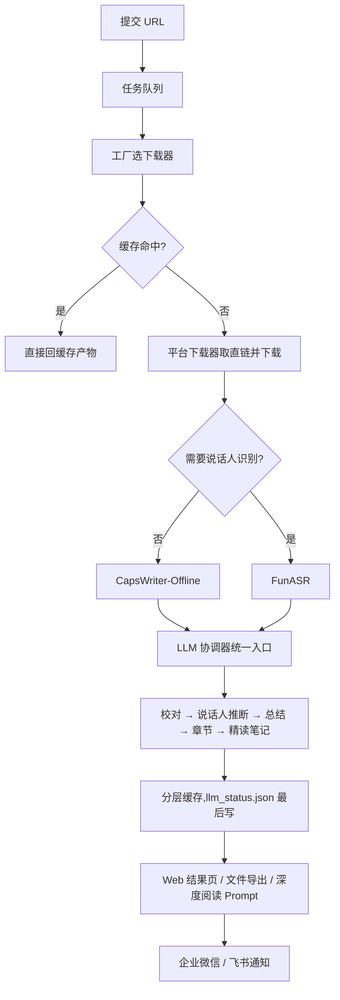

> 整理日期：2026-09-26
> 调研方式：把 [zlxlabs/VideoTranscriptAPI](https://github.com/zlxlabs/VideoTranscriptAPI)（commit `ec939ec`，2026-09-22）浅克隆到本地，用一组 AI 分析员并行深读全部功能模块，38 组 LLM 提示词逐一保真摘录分析，提示词清单另经独立审计员全仓检索复核（方法见[《ZCode 动态工作流》](/posts/zcode-dynamic-workflow/)）。文中结论均附 文件：行号，可回源码核对。
> 写作动机：我之前写过[《YouTube 转录 API 调研》](/posts/ToolsAndResources-YoutubeTranscriptApis/)，对「视频 → 文字」这条链路一直有兴趣。这个仓库有意思的地方在于：它不只是又一个转录工具——它本身就是一个「用 AI 长出来的项目」的活标本，连需求文档都是当初写给 AI 的提示词。

## 一、太长不看

**VideoTranscriptAPI** 是一个基于 Python 3.11 + FastAPI 的异步音视频转录服务：输入 YouTube / B站 / 抖音 / 小红书 / 微信视频号 / X(Twitter) / 小宇宙 / Apple Podcast 的链接，自动完成「下载 → 双引擎 ASR → LLM 校对/说话人推断/章节/总结/精读笔记 → Web 页面、文件导出与企微/飞书通知」。

整个系统最值得带走的四件事：

1. **下载矩阵的「依赖阶梯」设计**——每个平台用它最容易攻破的那条路：官方 API 能解决的绝不付费，打不过的整个外包给独立解析服务，平台差异被压缩在「URL → 直链」这一段；
2. **「结构交给确定性代码，理解交给 LLM」的流水线纪律**——LLM 校对结构化数据时只许回传「哪一行的哪个字段改成什么」，条数、说话人、时间戳由本地代码独占管理，结构损坏这类故障直接不存在了；
3. **它给自己写了个 Agent Skill 当「遥控器」**——skill 脚本模拟一个会用这套服务的人、通过项目 HTTP API 发请求，SKILL.md 把 agent 的工作流钉成死步骤，CLI 零依赖纯标准库，evals 连负面用例都测；
4. **它本身是 AI 委托式开发的活标本**——保留着最初写给 AI 的需求提示词、30 条带评分的委托台账、30+ 份 AI 会话交接文档，CI 用 AI 主审 + 影子评审做门禁。

端到端流程一张图：



---

## 二、项目速览

- **定位**：个人自用的音视频转录工作台（作者 zj1123581321，仓库现挂 zlxlabs org 下），README 附作者文章《LLM 吞噬一切，我用 AI 长出来的那些工具》；
- **技术栈**：Python 3.11+ / FastAPI / uv，前端轻量 JS + PWA，Docker digest 固定部署带健康检查回滚；
- **规模**：约 4.5 万行 Python 源码，130+ 单测文件、15+ 集成测试、50+ 需真实服务的 manual 测试；
- **许可**：PolyForm Noncommercial 1.0.0——**禁止商用**，借鉴思路没问题，直接搬代码要注意；
- **活跃度**：从委托台账和会话文档的时间戳看，2026-09 仍在高频迭代。

---

## 三、这个项目本身，就是「AI 委托式开发」的活标本

先讲最特别的发现。多数开源项目给你看代码，这个项目连「怎么被开发出来的」都完整留档了：

- **`docs/项目需求.md`** 保留着项目最初写给 AI 的需求提示词——整个项目起点的「第一因」；
- **`retro/acceptance-log.jsonl`** 是 30 条委托台账：每条记录用哪个 AI 执行器（codex gpt-5.6-luna、cursor composer-2.5 等）做了什么任务、验收结论，还带 taste / scope_discipline 评分——相当于给 AI 干活的「绩效档案」；
- **`docs/sessions/`** 下有 30+ 份 AI 会话交接/评审文档，跨 2026-07 到 2026-09；
- **CI 门禁是 AI 当主审**：`.github/workflows/gate.yml` 复用 zlxlabs/gate，AI 评审 + 并行影子评审（gate-shadow.yml）+ 误报处置（gate-disposition.yml）三件套；
- **`CLAUDE.md` 自标 `risk-tier: personal`**，`AGENTS.md` 写明沟通语言、测试纪律、提交规范——给 AI 助手的「员工手册」一应俱全。

人的角色在这里被压缩成两件事：出需求和给品味（taste 评分），工时全部外包给模型。这套「台账 + 评分 + AI 门禁」的开发方式本身，可能比任何一个具体实现都更值得抄。

---

## 四、一条 URL 进来之后：端到端八步

按代码实际执行顺序（不是文档顺序）还原：

**1. 提交任务**。API 收到 URL 后任务进入队列，`process_task_queue()`（`api/services/transcription.py:419`）逐个消费，状态机管理 PROCESSING → 终态。

**2. 工厂选下载器**。`create_downloader(url)` 按 URL 特征匹配平台适配器（下一节细讲）。

**3. 缓存检查**。按 URL/视频 ID 生成 media_id 查分层缓存——同一视频重复提交直接回上次产物，后面所有 LLM 花销全部跳过。

**4. 双引擎 ASR**。按任务是否需要说话人识别路由（`transcription.py:948` 的状态文案直接写明选了哪个引擎）：普通转录走 **CapsWriter-Offline**（本地、快），要「谁说了哪句」走 **FunASR**（带说话人分离）。产出逐段带时间戳的对话列表。

**5. 交接给 LLM 阶段**。`_handoff_to_llm_stage()`（`transcription.py:585`）把任务交给 `LLMCoordinator.process()`（`llm/coordinator.py:111`，统一入口）。任务级 `processing_options` 开关决定这单做到哪层：只要校对，还是到总结，还是到精读笔记。

**6. LLM 流水线**。按序执行五层，每层产物和状态（generated / skipped_short / failed / disabled）分开落盘：

- **校对**：文本按行编号喂给 LLM，LLM 只许回传 `{id, text}` 修正项，本地按 id 合并——条数、说话人、时间戳永远不会被模型改坏；专有名词从术语库注入提示词；
- **说话人推断**：从上下文把「说话人1」推断成真实称呼；
- **总结 + 关键信息抽取**；**章节划分**（带时间轴）；**精读笔记**。

全程三道护栏：token 用量 fail-open 记账（记账失败绝不拖垮主任务）、敏感词风控自动切换降级模型、提示词模板统一收在 `llm/prompts/`。

**7. 出结果**。产物写进缓存目录，`llm_status.json` **最后**写——它天然成为提交标记，任何中途失败都让缓存处于「未确认」态，下次自动补跑；Web 端 `/view/{token}` 页面渲染结果并支持导出，页面上还有「复制深度阅读 Prompt」按钮（第八节细讲这个巧妙设计）。

**8. 通知**。`finalize_terminal_status_and_notify()` 在终态时经 `NotificationRouter` 把带结果页链接的消息推到企业微信/飞书 webhook，逐渠道发送、失败单独记账。

---

## 五、下载器工厂：顺序即优先级，恒真做兜底

工厂只有 71 行（`downloaders/factory.py`），三步路由：

**第一步**，读配置开关 `downloaders.use_media_resolver`（默认 off，读取失败也按 off 处理——防御性读取）。

**第二步**，按开关组装候选列表，注释写明「顺序即优先级，取第一个 can_handle=True」：

| 模式 | 候选队列 |
|---|---|
| off（旧路径） | 抖音 → B站 → 小红书 → YouTube → 小宇宙 → Apple Podcast |
| on（迁移路径） | MediaResolver 排最前（接管抖音/小红书/视频号/X），旧抖音/小红书下载器**干脆不实例化** |

**第三步**，线性扫描，第一个认领该 URL 的下载器胜出；全军覆没就返回 `GenericDownloader()` 兜底——它的 `can_handle` 恒为 `True`。

匹配规则刻意简单：各平台的 `can_handle` 全是「域名子串在不在 URL 里」（`youtube.com`/`youtu.be`、`bilibili.com`/`b23.tv`、`douyin.com`/`v.douyin.com`……），没有复杂正则；只有 X 因为域名形态多才用了一个正则。能子串匹配解决的绝不引入复杂度。

真正的功夫在基类 `BaseDownloader`（`base.py:27`）：子类只实现 5 个抽象方法（认 URL、提 ID、拿元数据、拿下载信息、拿字幕），所有脏活都是模板方法——

- **实例级记忆化**：元数据按 video_id 缓存，同一任务里只发一次请求；
- **下载防御全套**（`download_file`，`base.py:208-325`）：3 次指数退避重试；大小上限双重拦截（Content-Length 预检 + 流式累计兜底，防直播回放填满磁盘）；下载完用 ffprobe 验证真的是音视频；失败只删自己这次的临时文件——注释特别说明绝不调全局清理，那是修过的并发误删 bug；
- **短链展开**：HEAD 跟随重定向，不支持 HEAD 的短链服务回退 GET+stream；
- **付费 API 统一封装**：主 key 失败自动换备用 key，401/403/404 不重试、5xx 重试、400 尝试换 URL 编码重发。

兜底的 `GenericDownloader` 因为来者不拒，把 SSRF 校验做成第一道工序：协议白名单、私网/回环/云元数据地址拦截、DNS 解析后 pin 住 IP、重定向最多 5 跳。

顺带一提小瑕疵：工厂是先实例化所有候选再逐个问 `can_handle`，而不是先匹配再实例化。好在下载器构造只读配置，实际无碍——但「先匹配后实例化」会更干净。

---

## 六、七个平台，七种武器

这是整个项目最「实战」的部分：**没有用统一的下载库，每个平台用它最容易攻破的那条路**。

### YouTube：三层降级，能不下载就不下载

1. 先用 `youtube-transcript-api` 拿官方字幕——视频有字幕就**根本不下载音频**，字幕直接进后续流程，省一次下载加一次 ASR；
2. 配置了自建 `youtube_api_server` 时走任务式 API（`POST /api/v1/tasks` 创建 → 轮询 → 返回视频信息 + 字幕 SRT 或音频直链），且**启用后不降级**——注释说明配了它就说明本机跑不通 yt-dlp，是给服务器部署用的；
3. 都不行才用 **yt-dlp**。

### B站：官方 API 为主，BBDown 二进制兜底

主路径直接调 B 站官方 web API（不登录），但先造一个随机 `buvid3` 指纹 cookie。注释写得很直白（`bilibili.py:37-43`）：「B 站对完全无 cookie 的服务器 IP 风控最严，附带一个随机指纹即可显著降低被 -412/-799 拦截的概率，且无需真实账号、零维护」。官方 API 失败则调外部 **BBDown** 可执行文件（按系统选 exe/Mac/Linux 版本），带 `-p 页码 --skip-subtitle --skip-cover --skip-ai` 参数，300 秒超时预算、空闲 60 秒判死。

### 抖音：TikHub 付费 API

短链 `v.douyin.com` 先展开，正则提取 `aweme_id`，调 TikHub `/api/v1/douyin/web/fetch_one_video` 拿无水印直链，文件下载自己来。风控最难啃的部分花钱外包。

### 小红书：TikHub 多端点降级表

最有工程味的一个：TikHub 的 4 个端点依次尝试，每个端点取视频流的 JSON 路径还不一样（如 `video_info_v2.media.stream.h264`）；连标题、作者都用一张元组适配表从不同响应结构里抠字段。把「上游响应不稳定」当成常态来设计。

### 小宇宙：零成本爬页面

播客音频在公开 CDN 上，直接 GET 单集页面 HTML，BeautifulSoup 找 `og:audio` 这个 meta 标签拿直链。一个付费 API 都不用。

### Apple Podcast：iTunes 官方 API

从 URL 提取节目 ID 和剧集 ID，调 Apple 官方公开接口 `itunes.apple.com/lookup`，在返回的剧集列表里匹配单集拿音频直链——完全官方、零风控。

### 微信视频号 + X(Twitter)：整体外包给独立解析服务

这两个平台风控最凶，项目干脆把「URL → 无水印直链 + 元数据」外包给独立的 **MediaResolverAPI** 服务（配置开关开启才启用）：客户端只做一次 `POST /api/resolve`（X-API-Key 鉴权），把响应的 `error.code` 映射成自己的异常体系（图文/已删除/私密等终态），**不做缓存、不做 SSRF、不下载文件**——职责边界在文件头注释里写死。旧模式下 `weixin.qq.com` 其实谁都不认、会掉进 Generic 兜底，视频号支持就是 resolver 模式带来的新能力。

---

## 七、外部服务的依赖阶梯

把上面的外部依赖整理成四档，规律一目了然：

| 档位 | 服务 | 用于 |
|---|---|---|
| 官方公开 API | iTunes lookup | Apple Podcast |
| 开源库/本地工具 | youtube-transcript-api、yt-dlp、BBDown | YouTube 首选/兜底、B站兜底 |
| 付费 SaaS | TikHub（主备 key） | 抖音、小红书（旧路径） |
| 自建解析服务 | MediaResolverAPI（内部再套 TikHub + Cobalt 兜底）、YouTube API Server | 视频号/X、抖音/小红书新路径、YouTube 服务器部署 |

两条值得记的观察：

**依赖会「向上迁移」**。设计文档（`docs/designs/media-resolver-integration.md`）记录了明确的演进方向：TikHub 直连的解析逻辑「易碎」（抖音单端点、小红书 4 端点回退 + 多 CDN 候选），于是把解析集中到自建的 MediaResolverAPI（内置多端点降级引擎 + Cobalt 兜底、覆盖 8 平台），本仓库自己退化成「下载 + 转录 + LLM」三件纯粹的事。**把易碎逻辑赶到边境服务里，核心仓库保持简单**——这个架构演进思路比任何单个下载技巧都更值得抄。

**换服务时要盯住语义变更**。同一份设计文档记录了换 resolver 的一个隐藏坑：旧抖音路径抓的是 `music.play_url`（mp3 音频），对套用热门 BGM 模板的口播视频，拿到的其实是**背景乐而不是人声**；新路径统一下完整 mp4 再用 ffmpeg 提音轨，转录才准。下载体积因此从 mp3 涨到 mp4，需要重新评估大小上限——换依赖不只是换接口，还是一次行为审计。

---

## 八、LLM 流水线与提示词工程精华

提示词全部集中管理：`llm/prompts/__init__.py` 里 16 个系统提示词常量共 1070 行（校对 ×2、含说话人校对、总结 ×2、精读笔记 ×3、结构化校对 ×4、输出校验、说话人推断、矛盾扫描、章节），加上统一校验提示词、关键信息抽取、标题生成、深度阅读模板等，全仓共 **38 组提示词**，专项分析员逐组保真摘录后集中审计过完整性。

38 组里我认为最值得学的四个手法：

**1. ID 锚点 + 本地合并，驯服 LLM 的结构破坏**（`schemas/calibration.py:5-9`）。LLM 校对结构化转录的经典翻车：返回条数对不上、说话人张冠李戴、整块 JSON 作废。这里的解法是输入按行编号，LLM 只允许回传 `{id, text}` 修正项，合并端按 id 查表——说话人、时间戳、条数由确定性管线独占，「结构不匹配」这个故障类直接不存在了。再叠加覆盖率统计识别截断/偷懒并触发重试（`speaker_aware_processor.py:875-882`）。任何「让 LLM 修改结构化数据」的场景（翻译、改写、逐条标注）都该这么干。

**2. 诚实状态文件当提交标记**（`cache_manager.py:1251-1323`）。LLM 全流程贵且慢，长流水线部分重跑是常态：整条重跑浪费钱，按「文件存在」判断又会把失败占位当成品。这里的做法是每层产物状态（generated / skipped_short / failed / disabled / none）落进 `llm_status.json`，并把该文件放在所有产物**最后**写、重写前先删——它天然成为 commit 标记，任何中途失败都让缓存处于「未确认」态自动补跑。用「最后写的状态文件当提交标记 + 写前撤销」替代事务日志，成本几乎为零。

**3. 深度阅读 Prompt 外置到用户侧**（`api/context.py:33-44`）。精读笔记这一步没有让服务端模型硬扛，而是渲染成结果页上的「复制深度阅读 Prompt」按钮：模板里 `{url}` 占位符替换为校对稿链接，用户粘贴到自己的联网聊天模型，由那个模型读全文产出分主题笔记。服务端省钱省算力，用户拿到可自己改造的提示词，配置还能整体覆盖预设（带非空和 `{url}` 存在性校验）——一石三鸟。

**4. 旁路记账三层 fail-open**（`llm_client.py:177-185`、`usage_recorder.py:109-111`）。token 用量审计要按任务/阶段记账，但记账失败绝不能让任务失败：记录器自包 try/except、异常只 warning、查询异常返回全零结构，另配 repair 兜底。任何「旁路记账」都可以套用——代价是审计可能缺行，所以要有兜底修复。

---

## 九、它还给自己写了 Agent Skill：给 AI 的「遥控器」

第三节说过这个项目是 AI 委托开发的——开发完的服务要被 AI 用，它就按 Agent Skill 的标准给自己做了个「遥控器」。思路一句话：**skill 脚本模拟一个会用这套服务的人，通过项目的 HTTP API 发请求**；SKILL.md 则把「这个人该有的操作常识」写成显式规则。整个 `skill/` 目录 5 个文件共 1121 行：

```text
skill/
├── SKILL.md                    # 235 行，主指令（真正"喂"给 agent 的提示词）
├── references/api.md           # 249 行，深度 API 参考（按需才读的第二层）
├── scripts/videotranscript.py  # 639 行，确定性 CLI
├── evals/evals.json            # 47 行，6 个评测用例
└── README.md
```

### SKILL.md：把「会用的人」的常识写成规则

七个写法里最值得抄的四个：

1. **description 按「触发率」优化**——三段式：第一句说清做什么；然后把用户的口语原话直接穷举进去（「即使只是说‘这个视频讲了啥’、‘帮我听一下这期播客’、‘给我这个节目的文字版’也要触发」）；最后写边界（「服务只接受 URL，不支持上传本地文件」）。用户怎么说，description 就怎么写。
2. **把工作流钉成死步骤**——异步任务最容易翻车的地方是 agent 拿到「处理中」就把用户晾着。它写死五步：submit → **「第一步永远是发查看链接……无论后续是否立即拿到结果，这一步都不能跳过」** → 立即试拉 → 202 则每分钟轮询最多 10 次 → 超时告知。措辞全是祈使句加绝对化约束。
3. **用失败案例代替「要小心」**——最精彩的一句：「查看链接必须从脚本输出中原样复制，**严禁自己拼接 URL**……LLM 重构 URL 极易拼错字母（如把 `lexgogo` 写成 `lexgugo`）」。它知道 LLM 的真实毛病是手痒重写 URL，把具体翻车样本写进规则，比泛泛说「注意准确性」有效十倍。
4. **决策表代替描述性语言**——什么时候加 `--speaker` 不靠 agent 自由发挥，给了一张七行决策表：多人访谈、用户说了「谁说的、分段、问答格式」→ 加；单人讲解、只要总结、拿不准 → 不加（更快，错了重提）。连「标题含‘对谈/圆桌/访谈’倾向加，含‘讲/教程/vlog’倾向不加」的启发式都写了。

此外还有：退出码语义表并嘱咐「遇到 exit 2 别无脑重试，先看 stderr」；HTTP fallback 一节专门标注「`/view/` 不需要鉴权、`/api/result/...` 不存在这个端点」——把 LLM 最容易幻觉出来的错误路径提前堵死；`references/api.md` 开头第一句是「只有 CLI 无法满足时才读这份」，SKILL.md 保持精简、深水区分层加载。

### 脚本：零依赖 HTTP 客户端，和服务只有契约关系

`videotranscript.py` 文件头第一行就亮明立场：`stdlib-only, cross-platform`。全部 import 只有标准库（`argparse/json/os/sys/urllib`，`videotranscript.py:24-34`），连 `requests` 都不用，更没有任何 `from video_transcript_api import ...`——因为 skill 会被安装到**用户的 agent 宿主机器**上，那台机器没有项目代码，也不该要求 pip install，装了 Python 就能跑。

它和项目的关系是 HTTP 契约，不是代码调用：skill 跑在 agent 机器上，服务跑在别处，中间只有 5 类端点——`submit` → `POST /api/transcribe`（Bearer 鉴权）、`result` → `GET /view/{view_token}?raw=type`（**无鉴权**）、`history` → `GET /api/audit/history` 等。`--speaker` 翻译成请求体里的 `use_speaker_recognition: true`，正是服务端「FunASR 还是 CapsWriter」的引擎开关。提交之后，下载/ASR/LLM 流水线全在服务端进程里，skill 对其一无所知也无需知道。

几个贴心细节：

- **多宿主环境变量自动补全**（`:60-109`）：启动时按序扫 `~/.hermes/.env` → `~/.claude/settings.json` 的 `env` 字段 → 脚本同目录 `.env`，缺失的补上、已有的不覆盖——SKILL.md 里说的三种配置方式，脚本端逐一兼容；
- **双地址分离**（`:126-140`）：API 请求走 `BASE_URL`（内网，图快），给用户的查看链接用 `PUBLIC_URL`（公网域名）拼；
- **帮 agent 闭环兜底**（`:305-328`）：服务端在缓存命中时不返回 `view_token`，agent 拿到 task_id 就断了线索——脚本反查最近 1000 条历史把 token 补回来；
- **202 是信号不是错误**（`:426-431`）：任务处理中返回 **exit 0** + 「仍在处理中」，agent 据此继续轮询；404/410 才是 exit 1。状态码语义被翻译成了 agent 能执行的决策。

退出码三层一致：异常类（`ConfigError/TransportError/BusinessError`）→ `main()` 映射为 3/2/1 → SKILL.md 的处置表——代码、退出码、文档说的是同一套话。

### evals：连「别多手」都测

`evals/evals.json` 里 6 个用例，每个是「模拟用户 prompt + 期望的 agent 行为」：B站单人视频（不加 `--speaker`、先发链接、不暴露 task_id）、小宇宙多人对谈（主动加 `--speaker`）、历史关键词查询（**不误触 submit**）、本地 mp3（**拒绝**并解释要先放到公网 URL）、B站转录（URL 原样复制**不许重写**）、YouTube 总结（主动轮询，「不要让用户主动来问进度」）。

注意后三个全是负面/纪律类用例——测「别多手」「守边界」「不重写」。改完 prompt 跑一遍 evals 就知道有没有回归，这是把 prompt 当代码管的做法。

### 这里的设计哲学

大多数人写 skill 会图省事直接 import 项目代码，结果 skill 和仓库绑死。这个项目把**自己的服务也当成外部服务对待**：skill 只依赖 HTTP 契约，服务端随便重构升级，只要端点不变，装出去的 skill 都不用动。这和第七节「把易碎逻辑赶到边境」是同一个哲学：核心仓库保持自由，边界靠契约锁住。

---

## 十、值得学习的优点清单（按优先级）

**强烈推荐学**：

- **配置预检「演练真实解析器」**（`context.py:374-405`）：`--check-config` 不维护第二套校验白名单，而是确认真实解析函数无副作用后直接调用它本身——校验与实现永不漂移。任何有预检命令的项目都适用；
- **ID 锚点 + 本地合并**（见上节）：LLM 时代处理结构化数据的通用答案；
- **诚实状态文件当提交标记**（见上节）：多阶段产物系统的廉价事务。

**值得借鉴**：

- **下载器工厂的「顺序即优先级 + 恒真兜底」**：新平台 = 新增子类 + 列表加一行，配置开关就能整队替换；
- **SSRF 防护的终态**（`pinned_ip_adapter.py`）：校验时解析出的 IP 直接用于连接，Host 头/SNI 保持真实域名，不引第三方库——任何「服务端代取 URL」的服务都能迁移；
- **退出码即 API**（`videotranscript.py:43-52,619-635`）：给 agent 写 CLI 时用少数语义正交的退出码（成功/业务失败/传输失败/配置错误），并在 skill 文档写明每类的处置策略——agent 的重试/上报决策立刻变得可靠；
- **测试门禁统一收口**（`conftest.py:30-45`）：52 个依赖真实企业微信 webhook 的 manual 测试零自查，十行 pytest collection hook 统一打标并 skip，且门禁本身被一个子进程回归测试锁定，防止未来重构时悄悄失效；
- **Agent Skill 的行为契约**（`skill/`）：SKILL.md 把 agent 工作流钉成步骤、失败案例写成规则、evals 连负面用例都测——把 prompt 当代码管（见第九节）。

**锦上添花**：

- 随机 `buvid3` 指纹绕 B 站风控的「零维护」路线；
- YouTube「有字幕就不下载」的成本砍法；
- AI 委托开发的整套台账 + 评分 + AI 门禁流程（见第三节）。

---

## 十一、局限与注意事项

- **许可**：PolyForm Noncommercial 1.0.0，禁止商用；
- **付费依赖**：TikHub 按量计费，抖音/小红书旧路径跑量就有成本；MediaResolverAPI 需要自己部署；
- **本文口径**：仅静态阅读源码（commit `ec939ec`），未实际运行服务验证下载/转写/LLM 调用的运行时行为，未运行其测试套件；模块级结论附有 文件：行号 可自行查证，提示词清单完整性经独立审计确认。

## 结语

看这个仓库，收获是双层的。第一层是工程：一个真实在用的多平台转录服务，把「每个平台用什么武器」「LLM 怎么安全地碰结构化数据」「长流水线怎么便宜地断点续跑」这些具体问题都给出了可抄的答案。第二层是方法：它整个是 AI 委托出来的，需求提示词、执行台账、品味评分、AI 门禁全留档——你会开始意识到，未来衡量一个项目的不仅是代码质量，还有「人和 AI 的分工界面设计得有多好」。这两层合起来，就是它最值得学的地方。

另见姊妹篇：[《拆解 video-to-subtitle-summary-skill》](/posts/video-to-subtitle-summary-skill-deep-dive/)——同一个命题（视频 → 字幕 → AI 总结）的另一种形态：没有常驻服务，一份 583 行的 SKILL.md 当「指挥层」、5 个可测脚本当「脚本层」，指挥宿主里的 Agent 跑完全流程。
